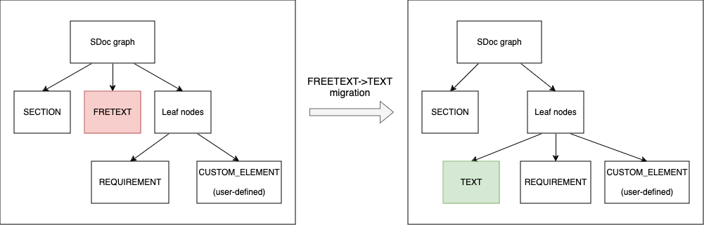

.. _SDOC_UG:

User Guide
$$$$$$$$$$

Introduction
============

StrictDoc is software for technical documentation and requirements management.

Summary of StrictDoc features:

- The documentation files are stored as human-readable text files.
- A simple domain-specific language DSL is used for writing the documents. The
  text format for encoding this language is called SDoc (strict-doc).
- StrictDoc reads \*.sdoc files and builds an in-memory representation of a
  document tree.
- From this in-memory representation, StrictDoc can generate the documentation
  into a number of formats including HTML, RST, ReqIF, PDF, JSON, Excel.
- StrictDoc has a web-based user interface which allows viewing and editing the documents and requirements. The changes are written back to .sdoc files.
- The focus of the tool is modeling requirements and specifications documents.
  Such documents consist of multiple statements like "system X shall do Y"
  called requirements.
- The requirements can be linked together to form the relationships, such as
  "parent-child". From these connections, many useful features, such as
  `Requirements Traceability <https://en.wikipedia.org/wiki/Requirements_traceability>`_
  and Documentation Coverage, can be derived.
- Requirements to source files traceability (experimental). See
  :ref:`Traceability between requirements and source code <SECTION-TRACEABILITY-REQS-TO-SOURCE-CODE>`.
- Custom grammar and custom fields support. The StrictDoc's grammar can be
  extended to support arbitrary special fields, such as "PRIORITY", "OWNER",
  or even more specialized fields, such as
  "Automotive Safety Integrity Level (ASIL)" or "Verification method".
  See :ref:`Custom grammars <SECTION-CUSTOM-GRAMMARS>`.
- Good performance of the `textX <https://github.com/textX/textX>`_
  parser and parallelized incremental generation of documents: generation of
  document trees with up to 2000–3000 requirements into HTML pages stays within
  a few seconds. From the second run, only changed documents are regenerated.
  Further performance tuning should be possible.

See also a summary of StrictDoc's existing limitations: :ref:`StrictDoc's limitations <SDOC_UG_LIMIT>`.

.. _SDOC_UG_CONTACT:

Contact the developers
----------------------

Join us in Discord. Here is the invitation link: https://discord.gg/4BAAME9MmG

The author can be also contacted via `email <s.pankevich@gmail.com>`_.

See also :ref:`F.A.Q. <SDOC_FAQ>` for common topics and :ref:`Troubleshooting <SDOC_TROUBLESHOOTING>` for troubleshooting the most common issues.

Examples
========

.. _SDOC_UG_HELLO_WORLD:

Hello World
-----------

"Hello World" example of the SDoc text language:

.. code-block:: text

    [DOCUMENT]
    TITLE: StrictDoc

    [REQUIREMENT]
    UID: SDOC-HIGH-REQS-MANAGEMENT
    TITLE: Requirements management
    STATEMENT: StrictDoc shall enable requirements management.

Create a file called ``hello_world.sdoc`` somewhere on your file system and copy the above "Hello World" example text to it. **The file must end with a newline character**.

Open a command-line terminal program supported on your system.

Once you have ``strictdoc`` installed (see :ref:`Installing StrictDoc <SDOC_UG_GETTING_STARTED>` below), switch to the directory with the ``hello_world.sdoc`` file. For example, assuming that the file is now in the ``workspace/hello_world`` directory in your user folder:

.. code-block:: text

    cd <your user home directory>/workspace/hello_world

Run StrictDoc as follows:

.. code-block:: text

    strictdoc export hello.sdoc

The expected output:

.. code-block:: text

    $ strictdoc export hello.sdoc
    Parallelization: Enabled
    Step 'Collect traceability information' start
    Step 'Find and read SDoc files' start
    Reading SDOC: hello.sdoc .................................... 0.08s
    Step 'Find and read SDoc files' took: 0.09 sec
    Step 'Collect traceability information' start
    Step 'Collect traceability information' took: 0.01 sec
    Step 'Collect traceability information' took: 0.11 sec
    Published: StrictDoc ........................................ 0.24s
    ...
    Export completed. Documentation tree can be found at:
    .../output/html

The HTML output produced so far has been generated statically. Now, start a StrictDoc server from the same directory:

.. code-block:: bash

    strictdoc server .

The expected output should contain the following line:

.. code-block:: text

    INFO:     Uvicorn running on http://127.0.0.1:5111 (Press CTRL+C to quit)

Open the URL in the browser and explore the contents of the example.

StrictDoc Examples repository
-----------------------------

The `strictdoc-examples <https://github.com/strictdoc-project/strictdoc-examples>`_ repository contains a collection of basic examples. Visit the repository and read its README for details.

StrictDoc Templates repository
------------------------------

The `strictdoc-templates <https://github.com/strictdoc-project/strictdoc-templates>`_ repository contains a growing collection of templates from the industry standards like DO-178C (aviation) and ECSS-E-ST-40C (space).

Other examples
--------------

For a more comprehensive example, check the source file of this documentation
which is written using StrictDoc:
`strictdoc_01_user_guide.sdoc <https://github.com/strictdoc-project/strictdoc/blob/main/docs/strictdoc_01_user_guide.sdoc>`_.

- `StrictDoc HTML export <https://strictdoc-project.github.io>`_
- `StrictDoc HTML export using Sphinx <https://strictdoc.readthedocs.io/en/latest>`_
- `StrictDoc PDF export using Sphinx <https://strictdoc.readthedocs.io/_/downloads/en/latest/pdf/>`_

.. _SDOC_UG_GETTING_STARTED:

Installing StrictDoc
====================

Requirements
------------

- Python 3.8+
- macOS, Linux or Windows
- Command-line terminal program

Depending on an operating system, a terminal program can be, for example:

- ``Terminal`` or ``iTerm2`` on macOS
- ``Gnome Terminal`` or ``konsole`` on Linux
- ``Terminal`` or ``PowerShell`` on Windows.

A terminal program is required to input all the commands outlined in this user guide.

Installing StrictDoc as a Pip package (recommended way)
-------------------------------------------------------

.. code-block:: text

    pip install strictdoc

Installing "nightly" StrictDoc as a Pip package
-----------------------------------------------

Sometimes, it takes a while before the latest features and fixes reach the stable Pip release. In that case, installing a Pip package from the Git repository directly is possible:

.. code-block::

    pip install -U --pre git+https://github.com/strictdoc-project/strictdoc.git@main

Installing StrictDoc into a Docker container
--------------------------------------------

StrictDoc can be invoked inside of a Docker container. To make data available
to the Docker container (here: ``strictdoc:latest``) as well as to the host
system, one needs to mount a volume via ``-v`` option.

In the host operating system terminal:

.. code-block:: text

    docker build . -t strictdoc:latest
    docker run --name strictdoc --rm -v "$(pwd)/docs:/data" -i -t strictdoc:latest

In the container terminal:

.. code-block:: text

    bash-5.1# strictdoc export .
    bash-5.1# exit

The documentation resides in ``./docs/output/html``.

Installing StrictDoc as a Snap package (not maintained)
-------------------------------------------------------

This way of installing StrictDoc is not maintained anymore. If you want to
use it, refer to the instructions located in ``developer/snap/README.md``.

Running StrictDoc
=================

Static HTML export
------------------

The easiest way to see the static HTML export feature in action is to run the :ref:`Hello World <SDOC_UG_HELLO_WORLD>` example.

The ``export`` command is the main producer of documentation. The native export format of StrictDoc is HTML. The ``export`` command supports a number of parameters, including the option for selecting export formats (HTML, RST, Excel, etc.). The options can be explored with the ``--help`` command.

.. code-block:: bash

    strictdoc export --help

Web server
----------

StrictDoc supports a web-based user interface. The StrictDoc web server is launched via the ``server`` command which accepts a path to a documentation tree as a parameter.

.. code-block:: bash

    strictdoc server .

The ``server`` command accepts a number of options. To explore the options, run:

.. code-block:: bash

    strictdoc server --help

**Note:** The implementation of the web interface is work-in-progress. See :ref:`Limitations of web user interface <SDOC_UG_LIMIT_WEB>` for an overview of the existing limitations.

Security considerations
-----------------------

.. warning::
    **TL;DR**: StrictDoc's web server is not yet hardened against unsafe use. Making StrictDoc safe for deployment in public networks is an ongoing effort.

    Using StrictDoc's command-line and web interfaces should be more secure if the web server is not deployed on a public network.

Due to current constraints (refer to :ref:`Limitations of web user interface <SDOC_UG_LIMIT_WEB>`), StrictDoc requires running a server through a command line interface in one window or OS process, and separately committing changes to documents using Git in another window or OS process. Deploying StrictDoc as a shared web server is impractical, as it still requires manual commits to SDoc files via the server's command line using Git. The future development plan for StrictDoc aims to enable its use as a standalone server application, which includes resolving the following security-related issues.

What makes StrictDoc's web server unsafe:

- The web interface is not fully hardened against unsafe inputs, such as malformed strings or files. The web server does not perform comprehensive sanity checks on the size and validity of inputs across all its HTTP endpoints.
- StrictDoc uses the `pickle <https://docs.python.org/3/library/pickle.html>`_ module to cache SDoc files, significantly improving performance. However, the pickle module is not secure. The pickled files are currently stored in the /tmp folder, which poses risks under certain circumstances.
- The security-related properties of the textX/Arpeggio parser are not understood yet. We have opened a request to track this upstream: `textX -  Security considerations (#422) <https://github.com/textX/textX/discussions/422>`_.
- Several uses of regular expressions may be unsafe, some of which have been identified by GitHub's CodeQL analyzer.
- The security aspects of StrictDoc's dependencies have not yet been analyzed.

Known security-related issues are tracked on GitHub, under the `"Security" label <https://github.com/strictdoc-project/strictdoc/issues?q=is%3Aissue+is%3Aopen+security+label%3ASecurity>`_. As StrictDoc becomes usable without command-line access, all known issues will need to be addressed or acknowledged as known limitations.

We are committed to continuously enhancing the functionality and security of StrictDoc and welcome user feedback and contributions in this area.

.. _SDOC_UG_IDE_SUPPORT:

IDE support
===========

StrictDoc language markup (SDoc) can be activated in all IDEs that support the
TextMate grammars. When the StrictDoc grammar is integrated into an IDE, the
SDoc syntax becomes highlighted just as any other syntax like Markdown, RST,
Python, etc.

The TextMate grammars can be defined in either JSON or PLIST formats.
The `Sublime Text's Syntax <https://www.sublimetext.com/docs/syntax.html>`_ is
similar to the TextMate grammar but has more capabilities and is no longer
backward-compatible with both TextMate's JSON and PLIST grammars.

The following IDEs are known to work:

- Microsoft Visual Studio Code (TextMate JSON)
- JetBrains's PyCharm and WebStorm (TextMate JSON). The other `JetBrains IDEs <https://www.jetbrains.com/products/>`_ are expected to work too.
- Eclipse (TextMate JSON)
- Sublime Text (Sublime Syntax)

Due to the incompatibilities between these formats, the markup files are provided in separate repositories:

- `strictdoc-project/strictdoc.tmLanguage <https://github.com/strictdoc-project/strictdoc.tmLanguage>`_ – TextMate grammar files for StrictDoc (JSON)
- `strictdoc-project/strictdoc.tmbundle <https://github.com/strictdoc-project/strictdoc.tmbundle>`_ – TextMate grammar files for StrictDoc (PLIST)
- `strictdoc-project/strictdoc.sublime-syntax <https://github.com/strictdoc-project/strictdoc.sublime-syntax>`_ –  StrictDoc markup syntax highlighting in Sublime Text.

The instructions for installing the StrictDoc markup can be found in all repositories.

For any other IDE, when possible, it is recommended to use the TextMate JSON
format, unless a given IDE is known to only support the TextMate bundle format
(``.tmbundle``). The exception is Sublime Text which has its own format.

**Note:** The TextMate grammar and the Sublime Syntax for StrictDoc only
provides syntax highlighting.
More advanced features like autocompletion and deep validation of requirements
can be only achieved with a dedicated Language Server Protocol (LSP)
implementation for StrictDoc. The StrictDoc LSP is on StrictDoc's long-term
roadmap, see `Enhancement: Language Protocol Server for SDoc text language #577
<https://github.com/strictdoc-project/strictdoc/issues/577>`_.

SDoc syntax
===========

StrictDoc defines a special syntax for writing specifications documents. This
syntax is called SDoc and it's grammar is encoded with the
`textX <https://github.com/textX/textX>`_
tool.

The grammar is defined using textX language for defining grammars and is
located in a single file:
`grammar.py <https://github.com/strictdoc-project/strictdoc/blob/main/strictdoc/backend/sdoc/grammar/grammar.py>`_.

This is how a minimal possible SDoc document looks like:

.. code-block:: text

    [DOCUMENT]
    TITLE: StrictDoc

This documentation is written using StrictDoc. Here is the source file:
`strictdoc_01_user_guide.sdoc <https://github.com/strictdoc-project/strictdoc/blob/main/docs/strictdoc_01_user_guide.sdoc>`_.

Document structure
------------------

An SDoc document consists of a ``[DOCUMENT]`` declaration followed by a sequence of nodes:

- Lead nodes: ``[TEXT]`` or ``[REQUIREMENT]``
- Composite nodes: ``[COMPOSITE_REQUIREMENT]``
- Section nodes that group other nodes recursively: ``[SECTION]``.

Each construct is described in more detail below.

.. _SECTION-UG-Strict-rule-1:

Strict rule #1: One empty line between all nodes
~~~~~~~~~~~~~~~~~~~~~~~~~~~~~~~~~~~~~~~~~~~~~~~~

StrictDoc's grammar requires each node, such as ``[REQUIREMENT]``, ``[SECTION]``,
etc., to be separated with exactly one empty line from the nodes surrounding it.
This rule is valid for all nodes. Absence of an empty line or presence of more
than one empty line between two nodes will result in an SDoc parsing error.

.. _SECTION-UG-Strict-rule-2:

Strict rule #2: No content is allowed outside of SDoc grammar
~~~~~~~~~~~~~~~~~~~~~~~~~~~~~~~~~~~~~~~~~~~~~~~~~~~~~~~~~~~~~

StrictDoc's grammar does not allow any content to be written outside of the SDoc
grammatical constructs. It is assumed that the critical content shall always be
written in form of requirements:
``[REQUIREMENT]`` and ``[COMPOSITE_REQUIREMENT]``. Non-critical content shall
be specified using ``[TEXT]`` nodes.

.. _SECTION-UG-Strict-rule-3:

Strict rule #3: No empty strings
~~~~~~~~~~~~~~~~~~~~~~~~~~~~~~~~

StrictDoc's grammar does not allow empty strings. This rule is applicable to
both single-line and multiline strings and both section fields and requirement
fields. A field is either missing or is a non-empty string.

The following patterns are all invalid for single-line fields:

.. code-block::

    [SECTION]
    TITLE:

    [SECTION]
    TITLE: (any number of space characters after colons)

    [REQUIREMENT]
    STATEMENT:

    [REQUIREMENT]
    STATEMENT: (any number of space characters after colons)

The following patterns are all invalid for multiline fields:

.. code-block::

    [REQUIREMENT]
    COMMENT: >>>
    <<<

    [REQUIREMENT]
    COMMENT: >>>
    (any number of space characters)
    <<<

If you need to provide a placeholder for a field that you know has to be filled
out soon, add a "TBD" (to be done, by our team) or a "TBC" (to be confirmed with a customer or a supplier) string.

The Project Statistics screen provides metrics for counting the number of TBDs (To Be Determined) and TBCs (To Be Confirmed) in a document, assisting in evaluating the document's maturity. This is a common practice in the regulared industries. See :ref:`Project statistics screen <SECTION-UG-Project-statistics-screen>` for more details.

Grammar elements
----------------

.. _SECTION-UG-Document:

Document
~~~~~~~~

The ``[DOCUMENT]`` element must always be present in an SDoc document. It is a
root of an SDoc document graph.

.. code-block:: text

    [DOCUMENT]
    TITLE: StrictDoc
    (newline)

The following ``DOCUMENT`` fields are allowed:

.. list-table:: SDoc grammar ``DOCUMENT`` fields
   :widths: 20 80
   :header-rows: 1

   * - **Field**
     - **Description**

   * - ``TITLE``
     - Title of the document (mandatory)

   * - ``UID``
     - Unique identifier of the document

   * - ``VERSION``
     - Current version of the document

   * - ``CLASSIFICATION``
     - Security classification of the document, e.g. Public, Internal, Restricted, Confidential

   * - ``REQ_PREFIX``
     - Requirement prefix that should be used for automatic generation of UIDs. See :ref:`Automatic assignment of requirements UID <SECTION-UG-Automatic-assignment-of-requirements-UID>`.

   * - ``ROOT``
     - Defines whether a document is a root object in a traceability graph. A root document is assumed to not have any parent requirements. The project statistics calculation will skip all root document's requirements when calculating the metric ``Non-root-level requirements not connected to any parent requirement``.

   * - ``OPTIONS``
     -  Document configuration options

The ``DOCUMENT`` declaration must always have a ``TITLE`` field. The other
fields are optional. The ``OPTIONS`` field can be used for specifying
the document configuration options. Note: The sequence of the fields is defined
by the document's Grammar, i.e. should not be changed.

.. _DOCUMENT_FIELD_OPTIONS:

Document configuration options
^^^^^^^^^^^^^^^^^^^^^^^^^^^^^^

The ``OPTIONS`` field may have the following attribute fields:

.. list-table:: SDoc grammar ``DOCUMENT``-``OPTIONS`` fields
   :widths: 20 80
   :header-rows: 1

   * - **Field**
     - **Attribute values**

   * - ``ENABLE_MID``
     - ``False`` (default), ``True``

   * - ``MARKUP``
     - ``RST`` (default), ``HTML``, ``Text``

   * - ``AUTO_LEVELS``
     - ``On`` (default), ``Off``

   * - ``REQUIREMENT_STYLE``
     - ``Inline`` (default), ``Table``, ``Zebra``

   * - ``REQUIREMENT_IN_TOC``
     - ``True`` (default), ``False``

ENABLE_MID
""""""""""

See :ref:`Machine identifiers (MID) <SECTION-UG-Machine-identifiers-MID>`.

MARKUP
""""""

The ``MARKUP`` option controls which markup renderer will be used.
The available options are: ``RST``, ``HTML`` and ``Text``. Default is
``RST``.

AUTO_LEVELS
"""""""""""

The ``AUTO_LEVELS`` option controls StrictDoc's system of automatic numbering
of the section levels.
The available options are: ``On`` /  ``Off``. Default is ``On``.

In case of ``On``, the ``[SECTION].LEVEL`` fields must be absent or may only
contain ``None`` to exclude that section from StrictDoc's automatic section
numbering. See also :ref:`Section without a level <SECTION_WITHOUT_A_LEVEL>`.

In case of ``Off``, all ``[SECTION].LEVEL`` fields must be populated.

REQUIREMENT_STYLE
"""""""""""""""""

The ``REQUIREMENT_STYLE`` option controls whether requirement's elements are
displayed inline or as table blocks. The available options are:

- ``Inline``
- ``Table``
- ``Zebra``

Default is ``Inline``.

.. code-block:: text

    [DOCUMENT]
    TITLE: Hello world
    OPTIONS:
      REQUIREMENT_STYLE: Inline

REQUIREMENT_IN_TOC
""""""""""""""""""

The ``REQUIREMENT_IN_TOC`` option controls whether requirement's title appear
in the table of contents (TOC). The available options are: ``True`` / ``False``.
Default is ``True``.

.. code-block:: text

    [DOCUMENT]
    TITLE: Hello world
    OPTIONS:
      REQUIREMENT_IN_TOC: True

Text
~~~~

A text node is the most basic document node which is used for normal document text.

.. code-block:: text

    [DOCUMENT]
    TITLE: StrictDoc

    [TEXT]
    STATEMENT: >>>
    StrictDoc is software for technical documentation.
    <<<

According to the :ref:`Strict rule #2: No content is allowed outside of SDoc grammar <SECTION-UG-Strict-rule-2>`, arbitrary content cannot be written outside of StrictDoc's grammar structure. The ``[TEXT]`` node is therefore a designated grammar element for writing arbitrary text content, unless the other nodes, such as ``REQUIREMENT``, are used instead.

.. warning::

    If your project still uses older ``[FREETEXT]`` tags, consider migrating to the new ``[TEXT]`` syntax. The rationale behind FREETEXT-TEXT change and the migration path are described in :ref:`FREETEXT-TEXT migration (June 2024) <SECTION-UG-FREETEXT-TEXT>`.

Requirement
~~~~~~~~~~~

The REQUIREMENT element is used for creating requirements, for example technical requirements or project requirements.

.. code-block:: text

    [DOCUMENT]
    TITLE: StrictDoc

    [REQUIREMENT]
    TITLE: Requirements management
    STATEMENT: StrictDoc shall enable requirements management.

The following ``REQUIREMENT`` fields are supported:

.. list-table:: SDoc grammar ``REQUIREMENT`` fields
   :widths: 20 80
   :header-rows: 1

   * - **Field**
     - **Description**

   * - ``UID``
     - Unique identifier of the requirement

   * - ``LEVEL``
     - Define section/requirement Level numbering

   * - ``STATUS``
     - Status of the requirement, e.g. ``Draft``, ``Active``, ``Deleted``

   * - ``TAGS``
     - Tags of the requirement (comma separated AlphaNum words)

   * - ``TITLE``
     - Title of the requirement

   * - ``STATEMENT``
     - The statement of the requirement. The field can be single-line or multiline.

   * - ``RATIONALE``
     - The rationale of the requirement. The field can be single-line or multiline.

   * - ``COMMENT``
     -  Comments to the rationale. The field can be single-line or multiline.
        Note: Multiple comment fields are possible.

   * - ``RELATIONS``
     - List of requirement relations. Note: Before StrictDoc v0.0.45, this field was called ``REFS``.

Currently, all ``[REQUIREMENT]``'s fields are optional but most of the time at
least the ``STATEMENT`` field as well as the ``TITLE`` field should be
present.

UID
^^^

Unique identifier of the requirement.

**Observation:** Some documents do not use unique identifiers which makes it
impossible to trace their requirements to each other. Within StrictDoc's
framework, it is assumed that a good requirements document has all of its
requirements uniquely identifiable, however, the ``UID`` field is optional to
accommodate for documents without connections between requirements.

StrictDoc does not impose any limitations on the format of a UID. Examples of
typical conventions for naming UIDs:

- ``REQ-001``, ``SCA-001`` (scalability), ``PERF-001`` (performance), etc.
- ``cES1008``, ``cTBL6000.1`` (example from NASA cFS requirements)
- Requirements without a number, e.g. ``SDOC-HIGH-DATA-MODEL`` (StrictDoc)
- ``SAVOIR.OBC.PM.80`` (SAVOIR guidelines)

.. code-block:: text

    [DOCUMENT]
    TITLE: StrictDoc

    [REQUIREMENT]
    UID: SDOC-HIGH-DATA-MODEL
    STATEMENT: STATEMENT: StrictDoc shall be based on a well-defined data model.

Level
^^^^^

Also a ``[REQUIREMENT]`` can have no section level attached to it. To enable
this behavior, the field ``LEVEL`` has to be set to ``None``.

Status
^^^^^^

Defines the current status of the ``[REQUIREMENT]``, e.g. ``Draft``, ``Active``,
``Deleted``.

Tags
^^^^

Allows to add tags to a ``[REQUIREMENT]``. Tags are a comma separated list of
single words. Only Alphanumeric tags (a-z, A-Z, 0-9 and underscore) are
supported.

.. _SDOC_UG_REQUIREMENT_RELATIONS:

Relations (previously REFS)
^^^^^^^^^^^^^^^^^^^^^^^^^^^

The ``RELATIONS`` field is used to connect requirements to each other:

.. code-block:: text

    [DOCUMENT]
    TITLE: StrictDoc

    [REQUIREMENT]
    UID: REQ-001
    STATEMENT: StrictDoc shall enable requirements management.

    [REQUIREMENT]
    UID: REQ-002
    TITLE: Requirement #2's title
    STATEMENT: Requirement #2 statement
    RELATIONS:
    - TYPE: Parent
      VALUE: REQ-001
    - TYPE: File
      VALUE: /full/path/file.py

The supported relation types are: ``Parent``, ``Child``, and ``File``. To be used in a requirement, the relations must be first registered in the document grammar. The default grammar defines ``Parent`` and ``File`` relation. See :ref:`Relations <SDOC_UG_GRAMMAR_RELATIONS>` for more details.

The ``RELATIONS`` must be the last field of a requirement. For ``TYPE: Parent`` and ``TYPE: Child`` relations, the ``VALUE`` attribute contains a parent/child's requirement
``UID``. A requirement may reference multiple parent or child requirements by
adding multiple ``TYPE``/``VALUE`` items. Defining circular
references e.g. ``Req-A`` ⇒ ``Req-B`` ⇒ ``Reg-C`` ⇒ ``Req-A`` results in validation errors and must be avoided.

The ``TYPE: File``-``VALUE`` attribute contains a filename referencing the
implementation of (parts of) this requirement. A requirement may add multiple
file references requirements by adding multiple ``TYPE: File``-``VALUE`` items.

**Note:** The ``TYPE: Parent`` and ``TYPE: Child`` are currently the only fully supported types of
connection. Linking requirements to files is still experimental (see also
:ref:`Traceability between requirements and source code <SECTION-TRACEABILITY-REQS-TO-SOURCE-CODE>`).

**Note:** In most requirements projects, only the Parent relations should be used, possibly with roles. The Child relation should be used only in specific cases. See :ref:`Parent vs Child relations <SDOC_UG_GRAMMAR_RELATIONS_PARENT_VS_CHILD>` for more details.

**Note:** In the near future, adding information about external references (e.g.
company policy documents, technical specifications, regulatory requirements,
etc.) is planned.

**Note:** By design, StrictDoc will only show parent or child links if both
requirements connected with a reference have ``UID`` defined.

Requirement relation roles
""""""""""""""""""""""""""

A requirement relation can be specialized with a role. The role must be registered in the document grammar, see :ref:`Relations <SDOC_UG_GRAMMAR_RELATIONS>`.

.. code-block::

    [DOCUMENT]
    TITLE: Example

    [GRAMMAR]
    ELEMENTS:
    - TAG: REQUIREMENT
      FIELDS:
      ...
      RELATIONS:
      - TYPE: Parent
        ROLE: Refines

    [REQUIREMENT]
    UID: REQ-2
    TITLE: Requirement title
    STATEMENT: >>>
    Requirement statement.
    <<<
    RELATIONS:
    - TYPE: Parent
      VALUE: REQ-1
      ROLE: Refines

In this example REQ-1 is the parent of REQ-2 and REQ-2 refines REQ-1.

Title
^^^^^

The title of the requirement.
Every requirement should have its ``TITLE`` field specified.

**Observation:** Many real-world documents have requirements with statements and
titles but some documents only use statements without title in which case their
``UID`` becomes their ``TITLE`` and vice versa. Example:

.. code-block:: text

    [DOCUMENT]
    TITLE: StrictDoc

    [REQUIREMENT]
    UID: REQ-001
    STATEMENT: StrictDoc shall enable requirements management.

Statement
^^^^^^^^^

The statement of the requirement. The field can be single-line or multiline.
Every requirement shall have its ``STATEMENT`` field specified.

Rationale
^^^^^^^^^

A requirement should have a ``RATIONALE`` field that explains/justifies why
the requirement exists. Like comments, the rationale field can be single-line
or multiline.

.. code-block:: text

    [DOCUMENT]
    TITLE: StrictDoc

    [REQUIREMENT]
    UID: REQ-001
    STATEMENT: StrictDoc shall enable requirements management.
    COMMENT: Clarify the meaning or give additional information here.
    RATIONALE: The presence of the REQ-001 is justified.

Comment
^^^^^^^

A requirement can have one or more comments explaining the requirement. The
comments can be single-line or multiline.

.. code-block:: text

    [DOCUMENT]
    TITLE: StrictDoc

    [REQUIREMENT]
    UID: REQ-001
    STATEMENT: StrictDoc shall enable requirements management.
    COMMENT: Clarify the meaning or give additional information here.
    COMMENT: >>>
    This is a multiline comment.

    The content is split via \n\n.

    Each line is rendered as a separate paragraph.
    <<<

.. _ELEMENT_SECTION:

Section
~~~~~~~

The ``[SECTION]`` element is used for creating document chapters and grouping
requirements into logical groups. It is equivalent to the use of ``#``, ``##``,
``###``, etc., in Markdown and ``====``, ``----``, ``~~~~`` in RST.

.. code-block:: text

    [DOCUMENT]
    TITLE: StrictDoc

    [SECTION]
    TITLE: High-level requirements

    [REQUIREMENT]
    UID: HIGH-001
    STATEMENT: ...

    [/SECTION]

    [SECTION]
    TITLE: Implementation requirements

    [REQUIREMENT]
    UID: IMPL-001
    STATEMENT: ...

    [/SECTION]

Nesting sections
^^^^^^^^^^^^^^^^

Sections can be nested within each other.

.. code-block:: text

    [DOCUMENT]
    TITLE: StrictDoc

    [SECTION]
    TITLE: Chapter

    [SECTION]
    TITLE: Subchapter

    [REQUIREMENT]
    STATEMENT: ...

    [/SECTION]

    [/SECTION]

StrictDoc creates section numbers automatically. In the example above, the
sections will have their titles numbered accordingly: ``1 Chapter`` and
``1.1 Subchapter``.

.. _SECTION_WITHOUT_A_LEVEL:

Section without a level
^^^^^^^^^^^^^^^^^^^^^^^

A section can have no level attached to it. To enable this behavior, the field
``LEVEL`` has to be set to ``None``.

.. code-block:: text

    [DOCUMENT]
    TITLE: Hello world doc

    [SECTION]
    TITLE: Section 1

    [/SECTION]

    [SECTION]
    LEVEL: None
    TITLE: Out-of-band Section

    [/SECTION]

    [SECTION]
    TITLE: Section 2

    [/SECTION]

The section with no level will be skipped by StrictDoc's system of automatic
numbering of the section levels (1, 1.1, 1.2, 2, ...).

The behavior of the ``LEVEL: None`` option is recursive. If a parent section
has its ``LEVEL`` set to ``None``, all its subsections' and requirements' levels
are set to ``LEVEL: None`` by StrictDoc automatically.

.. _UG_COMPOSABLE_DOCUMENTS:

Composing documents from other documents
~~~~~~~~~~~~~~~~~~~~~~~~~~~~~~~~~~~~~~~~

.. note::
    The composable documents is an early feature with only 50%+ of the implementation complete. See `Epic: UI: Composable documents <https://github.com/strictdoc-project/strictdoc/issues/1698>`_.

StrictDoc ``.sdoc`` files can be built-up from including other documents where a document can be included to no more than one including document.

The ``[DOCUMENT_FROM_FILE]`` element can be used anywhere body elements can be
used ( e.g. ``[SECTION]``, ``[REQUIREMENT``, ``[COMPOSITE_REQUIREMENT]`` etc.) and will
evaluate by inserting its contents from the file referenced by its ``FILE:`` property
where it was used in the parent document. The files included must be proper SDoc
documents and have a usual ``.sdoc`` extension.

Here is an example pair of files similar to examples above. First the
``.sdoc`` file has a ``[DOCUMENT_FROM_FILE]`` that references the latter file.

.. code-block:: text

    [DOCUMENT]
    TITLE: StrictDoc

    [DOCUMENT_FROM_FILE]
    FILE: include.sdoc

    [REQUIREMENT]

Then the referenced file, ``include.sdoc``:

.. code-block:: text

    [DOCUMENT]
    TITLE: Section ABC

    [REQUIREMENT]

    [SECTION]
    TITLE: Sub section
    [/SECTION]

    [COMPOSITE_REQUIREMENT]

    [REQUIREMENT]

    [/COMPOSITE_REQUIREMENT]

Which will resolve to the following document after inclusion:

.. code-block:: text

    [DOCUMENT]
    TITLE: StrictDoc

    [SECTION]
    TITLE: Section ABC

    [REQUIREMENT]

    [SECTION]
    TITLE: Sub section
    [/SECTION]

    [COMPOSITE_REQUIREMENT]

    [REQUIREMENT]

    [/COMPOSITE_REQUIREMENT]

    [/SECTION]

    [REQUIREMENT]

.. note::

    The Composable Documents feature belongs to the list of features that may be less portable when it comes to interfacing with other tools. See :ref:`Portability considerations <UG_PORTABILITY_CONSIDERATIONS>`.

.. _UG_COMPOSITE_REQUIREMENT:

Composite requirement
~~~~~~~~~~~~~~~~~~~~~

.. note::
    The composite requirements feature shows promise, but it has not yet attracted significant demand from both the core developers of StrictDoc and its users. While the use of composite requirements via the command line is implemented and supported, the web interface does not currently offer this support. Experience has shown that composite requirements can often be represented as a combination of sections and standard requirements. If there is a compelling use case for full support of composite requirements, please reach out to the developers.

A ``[COMPOSITE_REQUIREMENT]`` is a requirement that combines requirement
properties of a ``[REQUIREMENT]`` element and grouping features of a ``[SECTION]``
element. This element can be useful in lower-level specifications documents
where a given section of a document has to describe a single feature and the
description requires a one or more levels of nesting. In this case, it might be
natural to use a composite requirement that is tightly connected to a few
related sub-requirements.

.. code-block:: text

    [COMPOSITE_REQUIREMENT]
    STATEMENT: Statement

    [REQUIREMENT]
    STATEMENT: Substatement #1

    [REQUIREMENT]
    STATEMENT: Substatement #2

    [REQUIREMENT]
    STATEMENT: Substatement #3

    [/COMPOSITE_REQUIREMENT]

Special feature of ``[COMPOSITE_REQUIREMENT]``: like ``[SECTION]`` element, the
``[COMPOSITE_REQUIREMENT]`` elements can be nested within each other. However,
``[COMPOSITE_REQUIREMENT]`` cannot nest sections.

**Note:** Composite requirements should not be used in every document. Most
often, a more basic combination of nested ``[SECTION]`` and ``[REQUIREMENT]``
elements should do the job.

.. _SECTION-UG-Machine-identifiers-MID:

Machine identifiers (MID)
-------------------------

StrictDoc supports the automatic generation of machine identifiers (MIDs). This optional feature can be enabled individually for each document through the document-level ``ENABLE_MID`` config option:

.. code-block::

    [DOCUMENT]
    TITLE: Hello World!
    OPTIONS:
      ENABLE_MID: True

When the ``ENABLE_MID`` option is enabled, StrictDoc automatically generates MID fields whenever the document is written back to the file system. On the web server, MIDs are generated automatically when a document, section, or requirement is saved. In the command-line interface, the generation of ``MID`` can be initiated with a ``export`` command. Executing ``strictdoc export --formats sdoc`` on a document with ``ENABLE_MID: True`` results in all nodes having auto-generated MIDs. Implementing the ENABLE_MID option on a per-document basis allows for the integration of MID-enabled documents alongside third-party documents where the MID feature may not be necessary or desired.

Machine identifiers (MIDs) differ from and do not replace unique identifiers (UIDs). A requirement, section, or document node may have both ``MID`` and ``UID`` fields defined. For example:

.. code-block::

    [REQUIREMENT]
    MID: 06ab121d3c0f4d8c94652323b8f735c6
    UID: SDOC-SSS-70
    STATUS: Active
    TITLE: Move nodes between documents
    STATEMENT: >>>
    The Requirements Tool shall allow moving nodes (sections, requirements) between documents.
    <<<

Advantages of using machine identifiers:

1. Machine identifiers provide a robust means of identifying documents, sections, requirements, or custom nodes. An MID can uniquely identify a given node, independent of other fields like UID or TITLE.

2. The unique identification of nodes via MIDs enhances the effectiveness of StrictDoc's Diff/Changelog functionality. It allows the algorithm to accurately match requirements, sections, or document nodes, even if they are moved, renamed, or undergo metadata changes.

3. MIDs increase the portability of requirements data. Even when UID naming conventions change or nodes are relocated, the MID continues to uniquely identify the original node.

For larger projects, particularly those with extended maintenance cycles, we strongly recommend activating machine identifiers early in the project lifecycle. This proactive approach ensures robust tracking and management of documentation throughout the project's duration.

.. _SECTION-CUSTOM-GRAMMARS:

Custom grammars
---------------

**Observation:** Different industries have their own types of requirements
documents with specialized meta information.
Examples: ``ASIL`` in the automotive industry or
``HERITAGE`` field in some of the requirements documents by NASA.

StrictDoc allows declaration of custom grammars with custom fields that are
specific to a particular document.

First, such fields have to be registered on a document level using the
``[GRAMMAR]`` field. The following example demonstrates a declaration of
a grammar with four fields including a custom ``VERIFICATION`` field.

.. code-block:: text

    [DOCUMENT]
    TITLE: How to declare a custom grammar

    [GRAMMAR]
    ELEMENTS:
    - TAG: TEXT
      FIELDS:
      - TITLE: UID
        TYPE: String
        REQUIRED: False
      - TITLE: STATEMENT
        TYPE: String
        REQUIRED: True
    - TAG: REQUIREMENT
      FIELDS:
      - TITLE: UID
        TYPE: String
        REQUIRED: True
      - TITLE: VERIFICATION
        TYPE: String
        REQUIRED: True
      - TITLE: TITLE
        TYPE: String
        REQUIRED: True
      - TITLE: STATEMENT
        TYPE: String
        REQUIRED: True
      - TITLE: COMMENT
        TYPE: String
        REQUIRED: True

This declaration configures the parser to recognize the declared fields as
defined by a user. Declaring a special field as ``REQUIRED: True`` makes this
field mandatory for each and every requirement in the document.

When the fields are registered on the document level, it becomes possible to
declare them as the ``[REQUIREMENT]`` special fields:

.. code-block:: text

    [REQUIREMENT]
    UID: ABC-123
    VERIFICATION: Test
    STATEMENT: System A shall do B.
    COMMENT: Test comment.

Each grammar element must have exactly one content field named ``STATEMENT``,
``DESCRIPTION`` or ``CONTENT``. The content field plays a key role in the HTML
user interface as well as other export formats.

All fields before the content field are considered meta information. Meta information
fields are assumed to be single-line. The content field and all following fields
accept single-line and multiline strings.

**Note:** The order of fields must match the order of their declaration in the
grammar.

Supported field types
~~~~~~~~~~~~~~~~~~~~~

The supported field types are:

.. list-table:: SDoc grammar field types
   :widths: 20 80
   :header-rows: 1

   * - **Field Type**
     - **Description**

   * - ``String``
     - Simple String

   * - ``SingleChoice``
     - Enum-like behavior, one choice is possible. Must be single-line and thus
       has to be defined before the content field.

   * - ``MultipleChoice``
     - comma-separated words with fixed options. Must be single-line and thus has
       to be defined before the content field.

   * - ``Tag``
     - comma-separated list of tags/key words. Only Alphanumeric tags (a-z, A-Z, 0-9 and underscore) are supported.

   * - ``Reference``
     - **DEPRECATED:** comma-separated list with allowed reference types: ``ParentReqReference``, ``FileReference``. In the newer versions of StrictDoc (0.0.45+), a separate ``RELATIONS:`` section is used to configure the available relations.

Example:

.. code-block:: text

    [DOCUMENT]
    TITLE: How to declare a custom grammar

    [GRAMMAR]
    ELEMENTS:
    - TAG: TEXT
      FIELDS:
      - TITLE: UID
        TYPE: String
        REQUIRED: False
      - TITLE: STATEMENT
        TYPE: String
        REQUIRED: True
    - TAG: REQUIREMENT
      FIELDS:
      - TITLE: UID
        TYPE: String
        REQUIRED: True
      - TITLE: ASIL
        TYPE: SingleChoice(A, B, C, D)
        REQUIRED: True
      - TITLE: VERIFICATION
        TYPE: MultipleChoice(Review, Analysis, Inspection, Test)
        REQUIRED: True
      - TITLE: UNIT
        TYPE: Tag
        REQUIRED: True
      - TITLE: TITLE
        TYPE: String
        REQUIRED: True
      - TITLE: STATEMENT
        TYPE: String
        REQUIRED: True
      - TITLE: COMMENT
        TYPE: String
        REQUIRED: True
        REQUIRED: True
      RELATIONS:
      - Type: Parent
      - Type: File

    [TEXT]
    STATEMENT: >>>
    This document is an example of a simple SDoc custom grammar.
    <<<

    [REQUIREMENT]
    UID: ABC-123
    ASIL: A
    VERIFICATION: Review, Test
    UNIT: OBC, RTU
    TITLE: Function B
    STATEMENT: System A shall do B.
    COMMENT: Test comment.
    RELATIONS:
    - TYPE: Parent
      VALUE: REQ-001
    - TYPE: File
      VALUE: /full/path/file.py

Reserved fields
~~~~~~~~~~~~~~~

While it is possible to declare a grammar with completely custom fields, there
is a fixed set of reserved fields that StrictDoc uses for the presentation of the table of contents and the document structure:

.. list-table:: Reserved fields in SDoc's grammar
   :widths: 20 80
   :header-rows: 1

   * - **Reserved field**
     - **Description**

   * - UID
     - Requirement's UID.

   * - RELATIONS (previously REFS)
     - StrictDoc relies on this field to link requirements together and build traceability information.

       Note: The ``REFS`` field is deprecated and replaced with ``RELATIONS``.

   * - TITLE
     - Requirement's title. StrictDoc relies on this field to create
       document structure and table of contents.

   * - STATEMENT
     - Requirement's statement. StrictDoc presents this field as a long text
       block.

   * - COMMENT
     - One or more comments to a requirement.

   * - RATIONALE
     - The rationale for a requirement. Visually presented in the same way as a
       comment.

.. _SDOC_UG_GRAMMAR_RELATIONS:

Relations
~~~~~~~~~

The custom grammar configuration includes the optional ``RELATION:`` section which specifies the relations a given document supports.

.. code-block::

    [DOCUMENT]
    TITLE: Test Doc

    [GRAMMAR]
    ELEMENTS:
    - TAG: REQUIREMENT
      FIELDS:
      - TITLE: STATEMENT
        TYPE: String
        REQUIRED: True
      RELATIONS:
      - TYPE: Parent

    [REQUIREMENT]
    STATEMENT: >>>
    This is a statement.
    <<<
    RELATIONS:
    - TYPE: Parent
      VALUE: ID-001

The supported relation types are ``Parent``, ``Child``, ``File``. The Parent/Child relations are valid between requirements, the File relation connects a requirement with a file.

The default grammar relations, when a custom grammar is not specified, are ``Parent`` and ``File``.

Relation roles
^^^^^^^^^^^^^^

StrictDoc's custom grammar support the configuration of relation roles. The Parent and Child relations can be further specialized with roles, such as Refines, Implements, Verifies, etc.

.. code-block::

    [DOCUMENT]
    TITLE: Test Doc

    [GRAMMAR]
    ELEMENTS:
    - TAG: REQUIREMENT
      FIELDS:
      ...
      RELATIONS:
      - TYPE: Parent
        ROLE: Refines

With this grammar, StrictDoc will only allow creating requirements that have Parent relations with the ``ROLE: Refines`` specified. Any other relations will trigger validation errors.

.. _SDOC_UG_GRAMMAR_RELATIONS_PARENT_VS_CHILD:

Parent vs Child relations
^^^^^^^^^^^^^^^^^^^^^^^^^

**TL;DR** If there is no compelling reason to use the Child relations, avoid using them.

Most of the technical requirements documents can be modeled with just a Parent relation type. A typical traceability graph for a requirements project is typically child-to-parent, where the higher-level parent requirements are referred to as "Parents" by their child requirements.

For example, in one (parent) document:

.. code-block::

    [REQUIREMENT]
    UID: PARENT-1
    TITLE: Parent requirement
    STATEMENT: >>>
    ...
    <<<

Somewhere in another child document:

.. code-block::

    [REQUIREMENT]
    UID: CHILD-1
    TITLE: Child requirement
    STATEMENT: >>>
    ...
    <<<
    RELATIONS:
    - TYPE: Parent
      VALUE: PARENT-001

In some very special cases, it may be desired to also use the Child relations. For example, creating a so-called Compliance Matrix between a standard and a project requirement can use the Child relation to connect both the upper-level standard requirement with a project-level technical requirement:

.. code-block::

    [DOCUMENT]
    TITLE: Standard X Compliance Matrix

    [GRAMMAR]
    ELEMENTS:
    ...
    RELATIONS:
    - TYPE: Parent
    - TYPE: Child

    [REQUIREMENT]
    COMPLIANCE: Compliant.
    STATEMENT: >>>
    This is a compliance statement regarding the Standard X's STANDARD-001 requirement...
    <<<
    RELATIONS:
    - TYPE: Parent
      VALUE: STANDARD-001
    - TYPE: Child
      VALUE: PROJECT-001

With such a setup, StrictDoc generates the correct traceability graph that will link together the requirements of the PROJECT with the requirements of the STANDARD through the requirements of the compliance matrix.

Another example can be adapting the requirements of the Off-the-Shelf (OTS) project to the higher-level requirements of the user project. An intermediate requirements document can be created that connects the parent requirements of the user project with the immutable child requirements of the OTS project. This intermediate document can link the user requirement with the Parent and the OTS project with a Child link.

Both examples above involve activity called Tailoring when an intermediate document (Compliance Matrix) serves as an interface between two layers of documents.

Importing grammar from grammar file
~~~~~~~~~~~~~~~~~~~~~~~~~~~~~~~~~~~

A document grammar can be described in a separate file with an extension ``.sgra`` and imported to a document. This feature may be useful when multiple documents need to share the same grammar.

Example:

.. code-block::

    [DOCUMENT]
    TITLE: Document 1

    [GRAMMAR]
    IMPORT_FROM_FILE: grammar.sgra

    [REQUIREMENT]
    TITLE: Requirement title
    STATEMENT: >>>
    Requirement statement.
    <<<

A grammar file has an extension ``grammar.sgra`` and contains a usual grammar declaration which starts with a ``[GRAMMAR]`` tag.

.. code-block::

    [GRAMMAR]
    ELEMENTS:
    - TAG: REQUIREMENT
      FIELDS:
      - TITLE: TITLE
        TYPE: String
        REQUIRED: True
      - TITLE: STATEMENT
        TYPE: String
        REQUIRED: True

When a ``[GRAMMAR]`` is declared with an ``IMPORT_FROM_FILE`` line, the grammar from the grammar file becomes the document grammar as if it was declared directly in the document.

.. note::

    Editing of the grammars defined in ``.sgra`` files can be only done with a text editor, it is not implemented yet in the editable web interface.

.. _SDOC_UG_LINKS_AND_ANCHORS:

Links
-----

StrictDoc supports creating inline links to document sections, anchors, requirements and custom grammar elements.

Links
~~~~~

Elements that have an UID can be referenced from section text using a ``[LINK: <UID>]`` tag.
To reference a section that has an UID, use ``[LINK: <Section UID>]`` tag.
Likewise, a requirement can be referenced with ``[LINK: <Requirement UID>]``.

Example:

The following link references a section: :ref:`Links <SDOC_UG_LINKS_AND_ANCHORS>`.

**Note:** Adding a ``LINK`` tag will only work from the section text. In the requirement fields, the LINK tag will not be recognized.

Anchors
~~~~~~~

The ``[ANCHOR: <anchor uid>, <optional anchor title>]`` tag creates an anchor that can be referenced from other pages using ``[LINK <Anchor UID>]``.

Example:

This is a link to anchor: :ref:`Anchor ABC <ANCHOR-EXAMPLE>`.

Note: ``ANCHOR`` is a block-level tag. It has to be placed in the beginning of a line with a newline break after the tag.

Anchor example
^^^^^^^^^^^^^^

This section contains an anchor named ``Anchor ABC``.

.. _ANCHOR-EXAMPLE:

Search and filtering
====================

StrictDoc supports search and filtering of document content. However, this feature has not been extensively tested and is hidden behind a feature flag. To activate it, enable the corresponding setting in the ``strictdoc.toml`` configuration file:

.. code-block::

    [project]

    features = [
      "SEARCH"
    ]

The web interface includes the Search screen, designed for conducting queries against a document tree. The command-line interface supports filtering of requirements and sections through the ``export`` commands.

Query engine
------------

The syntax of the search query is inspired by Python, utilizing a fixed grammar that converts search queries into corresponding Python expressions.

Important rules:

- Every query component shall start with ``node.``.
- ``and`` and ``or`` expressions must be grouped using round brackets.
- Only double quotes are accepted for strings.

.. list-table:: Query examples
   :widths: 50 50
   :header-rows: 1

   * - **Query**
     - **Description**

   * - ``node.is_requirement``
     - Find all requirements.

   * - ``node.is_section``
     - Find all sections.

   * - ``node.is_root``
     - Find all requirements or sections from documents with ``ROOT: True``. See :ref:`Document <SECTION-UG-Document>` for the description of the ``ROOT`` option.

   * - ``(node.is_requirement and "System" in node["TITLE"])``
     - Find all requirements with a TITLE that equals to "System".

   * - ``(node.is_requirement and node.has_parent_requirements)``
     - Find all requirements which have parent requirements.

   * - ``(node.is_requirement and node.has_child_requirements)``
     - Find all requirements which have child requirements.

Filtering content
-----------------

Both ``export`` command-line interface commands support filtering documentation content with ``--filter-requirements`` and ``--filter-sections`` options.

Both options are based on the Query Engine, so the same rules that are valid for Search also apply for filtering. When a filter is applied, only the whitelisted requirements/sections will be exported.

Example:

.. code-block::

    strictdoc export . --filter-requirements '"System" in node["TITLE"]'

Markup
======

The Restructured Text (reST) markup is the default markup supported by
StrictDoc. The reST markup can be written inside all StrictDoc's text blocks,
such as ``STATEMENT``, ``COMMENT``, ``RATIONALE``, etc.

See the `reST syntax documentation <https://docutils.sourceforge.io/rst.html>`_
for a full reference.

Note: StrictDoc supports a Docutils-subset of RST, not a Sphinx-subset. See :ref:`Limitations of RST support by StrictDoc <SDOC_UG_LIMIT_RST>`.

The support of Tex and HTML is planned.

Images
------

To insert an image into a document, create a folder named ``_assets`` alongside your document and then place the image file into it.

This is the example of how images are included using the reST syntax:

.. code-block:: text

    [TEXT]
    STATEMENT: >>>
    .. image:: _assets/sandbox1.svg
       :alt: Sandbox demo
       :class: image
    <<<

**Note:** Currently, it is not possible to upload images via the web user interface. Therefore, you must manually place the image into the ``_assets`` folder using either the command-line or a file browser.

Mathjax support
---------------

StrictDoc can include the `MathJax <https://www.mathjax.org/>`_ Javascript library to all of the document templates. To activate MathJax, edit the ``strictdoc.toml`` config file in the root of your repository with documentation content.

.. code-block::

    [project]
    title = "My project"

    features = [
      "MATHJAX"
    ]

Example of using MathJax:

.. code-block:: text

    [TEXT]
    STATEMENT: >>>
    The following fragment will be rendered with MathJax:

    .. raw:: latex html
        $$
        \mathbf{\underline{k}}_{\text{a}} =
        \mathbf{\underline{i}}_{\text{a}} \times
        \mathbf{\underline{j}}_{\text{a}}
        $$
    <<<

See :ref:`Selecting features <SDOC_UG_CONFIG_FEATURES>` for the description of other features.

Export formats
==============

HTML documentation tree by StrictDoc
------------------------------------

This is a default export option supported by StrictDoc.

The following command creates an HTML export:

.. code-block:: text

    strictdoc export docs/ --formats=html --output-dir output-html

**Example:** This documentation is exported by StrictDoc to HTML:
`StrictDoc HTML export <https://strictdoc-project.github.io>`_.

The options ``--formats=html`` and ``--output-dir output-html`` can be skipped because HTML export is a default export option and the default output folder is ``output``.

StrictDoc does not detect .sdoc files in the output folder. This is based on the assumption that StrictDoc should not read anything in the output folder, which is intended for transient output artifacts.

Standalone HTML pages
~~~~~~~~~~~~~~~~~~~~~

The following command creates a normal HTML export with all pages having their
assets embedded into HTML using Data URI / Base64. In the project's ``strictdoc.toml`` file, specify:

.. code-block:: yaml

    [project]

    features = [
      "STANDALONE_DOCUMENT_SCREEN"
    ]

The generated document are self-contained HTML pages that can be shared via
email as single files. This option might be especially useful if you work with
a single document instead of a documentation tree with multiple documents.

HTML export via Sphinx
----------------------

The following command creates an RST export:

.. code-block:: text

    strictdoc export YourDoc.sdoc --formats=rst --output-dir output

The created RST files can be copied to a project created using Sphinx, see
`Getting Started with Sphinx <https://docs.readthedocs.io/en/stable/intro/getting-started-with-sphinx.html>`_.

.. code-block:: text

    cp -v output/YourDoc.rst docs/sphinx/source/
    cd docs/sphinx && make html

`StrictDoc's own Sphinx/HTML documentation
<https://strictdoc.readthedocs.io/en/latest/>`_
is generated this way, see the Invoke task:
`invoke sphinx <https://github.com/strictdoc-project/strictdoc/blob/5c94aab96da4ca21944774f44b2c88509be9636e/tasks.py#L48>`_.

PDF export via Sphinx/LaTeX
---------------------------

The following command creates an RST export:

.. code-block:: text

    strictdoc export YourDoc.sdoc --formats=rst --output-dir output

The created RST files can be copied to a project created using Sphinx, see
`Getting Started with Sphinx <https://docs.readthedocs.io/en/stable/intro/getting-started-with-sphinx.html>`_.

.. code-block:: text

    cp -v output/YourDoc.rst docs/sphinx/source/
    cd docs/sphinx && make pdf

`StrictDoc's own Sphinx/PDF documentation
<https://strictdoc.readthedocs.io/_/downloads/en/latest/pdf/>`_
is generated this way, see the Invoke task:
`invoke sphinx <https://github.com/strictdoc-project/strictdoc/blob/5c94aab96da4ca21944774f44b2c88509be9636e/tasks.py#L48>`_.

JSON
----

The following command creates a JSON export:

.. code-block::

    strictdoc export YourDoc.sdoc --formats=json --output-dir output/

The structure of the exported JSON mostly mirrors the structure of the underlying SDoc objects that represent the project tree, documents, sections, requirements, and other nodes.

When the exported documents are included to other documents using the :ref:`Composing documents from other documents <UG_COMPOSABLE_DOCUMENTS>` feature, the JSON export does not include the included documents but only the including documents with the included content. This can be changed by adding the ``--included-documents`` option.

Manage project tree
===================

.. _SECTION-UG-Automatic-assignment-of-requirements-UID:

Automatic assignment of requirements UID
----------------------------------------

To assign requirement UIDs automatically:

.. code-block::

    strictdoc manage auto-uid <path-to-project-tree>

The command goes over all requirements in the project tree and assigns missing UIDs automatically. The project tree is mutated in-place.

By default, the assignment happens based on the requirement mask ``REQ-``, so the requirements will get the UIDs of ``REQ-001``, ``REQ-002``, ...

If a document-level or a section-level requirement mask is provided, the UIDs will be generated based on that mask.

A document-level requirement mask:

.. code-block::

    [DOCUMENT]
    TITLE: Hello world doc
    REQ_PREFIX: MYDOC-

A section-level requirement mask:

.. code-block::

    [SECTION]
    TITLE: Section 2.
    REQ_PREFIX: LEVEL2-REQ-

.. _SECTION-TRACEABILITY-REQS-TO-SOURCE-CODE:

Traceability between requirements and source code
=================================================

**Note:** This feature is experimental, the documentation is incomplete.

StrictDoc allows connecting requirements to source code files in two ways:

1. Linking source files to requirements by adding special markers in the source code without modifying the requirements.
2. Linking requirements to source files by adding relations in the requirements without altering the source code.

The advantage of the first approach is that requirements remain agnostic to the source code and implementation details. Special markers are added solely to the source files, creating traceability back to the requirements.

The benefit of the second approach is that traceability to source files is established without any modification to the source code. This can be useful in projects where adding markers to the source code is undesirable or not feasible.

Both options can be used independently or in combination, depending on the project setup and allocation of software components.

To activate the traceability to source files, configure the project config with a dedicated feature:

.. code-block:: yaml

    [project]

    features = [
      "REQUIREMENT_TO_SOURCE_TRACEABILITY"
    ]

By default, StrictDoc looks for source files in a directory from which the ``strictdoc`` command is run. This can be changed by using the ``source_root_path`` project-level option.

See :ref:`Project-level options <SDOC_UG_OPTIONS_PROJECT_LEVEL>` for more details about the project-level options.

The
`strictdoc-examples <https://github.com/strictdoc-project/strictdoc-examples>`_
repository contains executable examples including the example of
requirements-to-source-code traceability.

.. _SECTION-UG-Language-aware-parsing-of-source-code:

Language-aware parsing of source code
-------------------------------------

For parsing source code and calculating traceability to requirements, StrictDoc uses a general parser that is agnostic of specific programming languages and their constructs, such as classes or functions. However, for languages with these constructs, establishing traceability to them can simplify the tracing process.

As an experimental option, StrictDoc supports parsing source files of selected programming languages (currently Python and C) to recognize language syntax, primarily enabling traceability of functions (in Python, C, and others) and classes (in Python, C++, and others) to requirements.

To activate language-aware traceability, configure the project with the following features:

.. code:: toml

    [project]

    features = [
      "REQUIREMENT_TO_SOURCE_TRACEABILITY",
      "SOURCE_FILE_LANGUAGE_PARSERS"
    ]

Currently, only Python and C parsers are implemented. Upcoming implementations include parsers for Rust, C++, Bash, and more.

Linking source code to requirements
-----------------------------------

To connect a source file to a requirement, a dedicated ``@relation`` marker must be added to the source file. Several marker types are supported, depending on the programming language. For example, the ``scope=class`` option is available for Python files but not for C files, as C does not support classes.

.. note::

    For language-specific parsing of source code, e.g., Python and C, make sure to enable the corresponding option, see :ref:`Language-aware parsing of source code <SECTION-UG-Language-aware-parsing-of-source-code>`.

.. warning::

    The legacy ``@sdoc`` marker is still supported by StrictDoc but is deprecated. ``@relation`` is the new correct marker name.

**1\) Linking a file to a requirement**

The marker must be added to the top comment of a file.

.. code:: python

    """
    This file implements ...

    @relation(REQ-1, scope=file)
    """

**2\) Linking a class to a requirement (Python only)**

.. code:: python

    class Foo:
        """
        This class implements ...

        @relation(REQ-1, scope=class)
        """

**3\) Linking a function to a requirement (Python and C only)**

.. code:: python

    class Foo:
        def bar(self):
            """
            This function implements ...

            @relation(REQ-1, scope=function)
            """

or

.. code:: c

    /**
     * Some text.
     *
     * @relation(REQ-1, scope=function)
     */
    void hello_world(void) {
        print("Hello, World\n");
    }

**4\) Linking a range to a requirement**

.. code:: python

    def foo():
        # @relation(REQ-1, scope=range_start)
        print("Hello, World!")
        # @relation(REQ-1, scope=range_end)

**5\) Linking a single line to a requirement**

.. code:: python

    def foo():
        # @relation(REQ-1, scope=line)
        print("Hello, World!")

Linking requirements to source code
-----------------------------------

The linking of requirements to source files is arranged with a special RELATION type ``File``.

.. note::

    For language-specific parsing of source code, e.g., Python and C, make sure to enable the corresponding option, see :ref:`Language-aware parsing of source code <SECTION-UG-Language-aware-parsing-of-source-code>`.

**1\) Linking a requirement to a whole source file**

.. code-block:: text

    [REQUIREMENT]
    UID: REQ-001
    RELATIONS:
    - TYPE: File
      VALUE: file.py
    TITLE: File reference
    STATEMENT: This requirement references the file.

**2\) Linking a requirement to range in a source file**

.. code-block:: text

    [REQUIREMENT]
    UID: REQ-002
    TITLE: Range file reference
    STATEMENT: This requirement references the file.py file.
    RELATIONS:
    - TYPE: File
      VALUE: file.py
      LINE_RANGE: 2, 4

**3\) Linking a requirement to a function in a source file**

.. code-block:: text

    [REQUIREMENT]
    UID: REQ-002
    TITLE: Function reference
    STATEMENT: This requirement references a function in a file.
    RELATIONS:
    - TYPE: File
      VALUE: file.py
      FUNCTION: hello_world
    - TYPE: File
      VALUE: file.c
      FUNCTION: Foo.hello_world_2

.. note::

    For linking to functions in classes, a class name has to be added in a format: ``<class name>.<function name>``. This is currently only supported for Python source files.

**4\) Linking a requirement to a class in a source file (Python only)**

.. code-block:: text

    [REQUIREMENT]
    UID: REQ-002
    TITLE: Class reference
    STATEMENT: This requirement references a class in a file.
    RELATIONS:
    - TYPE: File
      VALUE: file.py
      CLASS: Foo

ReqIF support
=============

StrictDoc has an initial support of exporting to and importing from the ReqIF
format.

**Note:** It is not possible to implement a single export/import procedure that
works well for all ReqIF XML files produced by various requirements management
tools. The export/import workflow is therefore tool-specific. See
:ref:`ReqIF implementation details <SECTION-REQIF-DETAILS>` for more details.

Supported formats:

- StrictDoc's "native" export/import between SDoc and ReqIF

Planned formats:

- The format recommended by the
  `ReqIF Implementation Guide <https://www.ps-ent-2023.de/fileadmin/prod-download/PSI_ImplementationGuide_ReqIF_V1-7.pdf>`_
  that attempts to harmonize the developments of ReqIF by requirements
  management tools.

Import flow (ReqIF -> SDoc)
---------------------------

.. code-block:: text

    strictdoc import reqif sdoc input.reqif output.sdoc

The command does the following:

1. The ReqIF is parsed from XML file to ReqIF in-memory model using the ``reqif``
   library.

2. The ReqIF in-memory model is converted to SDoc in-memory model. In this case,
   ``sdoc`` indicates that the native ReqIF-to-SDoc conversion procedure must be
   used.

3. The SDoc in-memory model is written to an .sdoc file.

Export flow (SDoc -> ReqIF)
---------------------------

.. code-block:: text

    strictdoc export --formats=reqif-sdoc %S/input.sdoc

The command does the following:

1. The SDoc file is parsed to an SDoc in-memory model.
2. The SDoc in-memory model is converted to a ReqIF in-memory model using the
   native SDoc-to-ReqIF conversion procedure as indicated by the ``reqif-sdoc``
   argument.
3. The ReqIF in-memory model is unparsed a to ReqIF XML file using ``reqif``
   library.

.. _SECTION-UG-ReqIF-options:

ReqIF options
-------------

The following options are available for ReqIF export/import commands.

``--reqif-multiline-is-xhtml`` This option makes StrictDoc to export all multiline fields as XHTML attributes, not as STRING (the default behavior). This is useful for interfacing with tools, such as Polarion, which assume XHTML as the primary format for writing multiline text.

``--reqif-import-markup={RST,HTML,Text}`` This option makes StrictDoc import ReqIF to SDoc documents, setting their ``MARKUP`` option to the markup value provided. The default value is RST which is the default markup of StrictDoc. When working with other ReqIF tools, very often this option can be set to HTML. It is likely that with this option, the previous option ``--reqif-multiline-is-xhtml`` should be enabled as well.

``--reqif-enable-mid`` This option requires the machine identifiers option to be enabled (see :ref:`Machine identifiers (MID) <SECTION-UG-Machine-identifiers-MID>`) and allows all nodes machine identifiers (MID) exported as ReqIF IDENTIFIERs. This option can be useful when the MID/IDENTIFIER stability of document, section, and requirement nodes is critical when doing iterative export/import roundtrips.

All options can be also specified in a project's TOML file as follows:

.. code-block::

    [project]

    [reqif]
    multiline_is_xhtml = true
    import_markup = "HTML"
    enable_mid = true

.. _SECTION-REQIF-DETAILS:

ReqIF implementation details
----------------------------

The ReqIF is a `standard <https://www.omg.org/spec/ReqIF>`_ which is
maintained by Object Management Group (OMG). One important feature of the
ReqIF standard is that it requires a fixed XML structure but still leaves
certain details open to the implementation by the ReqIF and requirements
management tools developers. Specifically, each tool may use it own field
names and structure to represent requirements and sections/chapters.

In order to accommodate for the differences between ReqIF files produced by
various tools, the ReqIF processing is split into two layers:

1) Parsing ReqIF from ``.reqif`` XML files into ReqIF in-memory tree of Python
objects as well as unparsing the ReqIF in-memory tree back to ReqIF XML files is
extracted to a separate library:
`strictdoc-project/reqif <https://github.com/strictdoc-project/reqif>`_.

2) Converting between in-memory trees of SDoc and ReqIF. This layer is part of
StrictDoc.

For further overview of the ReqIF format and the ``reqif`` library's
implementation details, refer to
`strictdoc-project/reqif <https://github.com/strictdoc-project/reqif>`_'s
documentation.

Excel support
=============

StrictDoc provides a support for Excel XLS on input and Excel XLSX on output.

On input, the headers of sheet1 are used to put together a custom grammar and
the requirements are imported one row per requirement. A best effort is made by
the importer to recognize names of headers and map these to strictdoc
requirement fields.

Note: A roundtrip "SDoc -> Excel -> SDoc" is not yet supported.

Import flow (Excel XLS -> SDoc)
-------------------------------

.. code-block:: text

    strictdoc import excel basic input.xls output.sdoc

The command does the following:

1. The Excel XLS is parsed to SDoc in-memory model using the ``xlrd``
   library.

2. The SDoc in-memory model is written to an .sdoc file.

Export flow (SDoc -> Excel XLSX)
--------------------------------

.. code-block:: text

    strictdoc export --formats=excel --output-dir=Output input.sdoc

The command does the following:

1. The SDoc file is parsed to an SDoc in-memory model.

2. The SDoc in-memory model is converted to an Excel XLSX file using
   the ``XlsWriter`` library.

For exporting only selected fields:

.. code-block:: text

    strictdoc export --formats=excel --fields=UID,STATUS --output-dir=Output input.sdoc

For exporting a folder with multiple SDoc files, specify a path to a folder or ``.`` for a current directory:

.. code-block:: text

    strictdoc export --formats=excel .

If the ``output-dir`` option is not provided, the ``output/`` folder is the default value.

Options
=======

.. _SDOC_UG_OPTIONS_PROJECT_LEVEL:

Project-level options
---------------------

StrictDoc supports reading configuration from a TOML file. The file must be called ``strictdoc.toml`` and shall be stored in the same folder which is provided as a path to the SDoc documents.

For example, ``strictdoc export .`` will make StrictDoc recognize the config file, if it is stored under the current directory.

Project title
~~~~~~~~~~~~~

This option specifies a project title.

.. code-block::

    [project]
    title = "StrictDoc Documentation"

Path to assets
~~~~~~~~~~~~~~

By default, StrictDoc copies its CSS/JS and other asset files to a folder ``_static`` in the HTML output directory.

Sometimes, it is desirable to change the folder name. For example, the GitHub Pages static website engine expects the assets to be found in the ``assets`` folder.

The ``html_assets_strictdoc_dir`` allows changing the assets folder name:

.. code-block::

    [project]
    html_assets_strictdoc_dir = "assets"

Path to cache dir
~~~~~~~~~~~~~~~~~

StrictDoc uses caching when reading and writing artifacts. By default, all caches are written to the system's temporary directory (``$TMPDIR``).

The ``cache_dir`` option in the configuration file allows specifying a custom directory, such as ``./output/build``. This setting can help make caching artifacts visible alongside documentation artifacts.

.. code:: toml

    [project]
    cache_dir = "./output/cache"

See :ref:`Caching artifacts <SECTION-DD-Caching-artifacts>` for an overview of how caching works.

Path to source root
~~~~~~~~~~~~~~~~~~~

When the ``REQUIREMENT_TO_SOURCE_TRACEABILITY`` feature is activated, StrictDoc looks for source files in the directory from which the ``strictdoc`` program is run. This can be changed with the ``source_root_path`` option.

.. code-block::

    [project]

    features = [
      "REQUIREMENT_TO_SOURCE_TRACEABILITY",
    ]

    source_root_path = "source_root/"

The ``source_root_path`` option supports relative paths, e.g. ``../source_root/``.

Include/exclude document paths
~~~~~~~~~~~~~~~~~~~~~~~~~~~~~~

Use ``include_doc_paths`` and ``exclude_doc_paths`` paths to whitelist/blacklist paths to SDoc documents.

In the following example, StrictDoc will look for all files in the input project directory, except all documents in the ``tests/`` folder.

.. code-block:: yaml

    [project]

    include_doc_paths = [
      "**"
    ]

    exclude_doc_paths = [
      "tests/**"
    ]

The behavior of wildcard symbols ``*`` and ``**`` is as follows:

- The ``*`` expands to any combination of symbols that represent a valid file name, excluding the forward and backward slashes, which limits this wildcard to only match a single directory.

- The ``**`` expands to any combination of valid file name symbols, possibly separated by any number of slashes.

.. list-table:: Examples of possible filter strings
   :widths: 20 80
   :header-rows: 1

   * - **Example**
     - **Description**

   * - ``docs/*`` or ``docs/*.sdoc``
     - Match all documents found in the ``docs/`` folder but not in its subdirectories.

   * - ``docs/**``
     - Match all documents found in the ``docs/`` folder and all its subdirectories.
   * - ``**/docs/**``
     - Match all documents found in the ``docs/`` folder and all its subdirectories. The ``docs/`` folder can be a top-level folder or at any level of depth.

Include/exclude source files paths
~~~~~~~~~~~~~~~~~~~~~~~~~~~~~~~~~~

Use ``include_source_paths`` and ``exclude_source_paths`` to whitelist/blacklist paths to source files when the traceability between requirements and source files feature is enabled.

.. code-block:: yaml

    [project]

    features = [
      "REQUIREMENT_TO_SOURCE_TRACEABILITY"
    ]

    include_source_paths = [
      "src/**"
    ]

    exclude_source_paths = [
      "src/tests/**"
    ]

The behavior of the wildcards is the same as for the ``include_doc_paths/exclude_doc_paths`` options.

.. _SDOC_UG_CONFIG_FEATURES:

Selecting features
~~~~~~~~~~~~~~~~~~

StrictDoc has optional features and features that are developed with a lower priority.

The feature of exporting the SDoc documents to HTML document view is a core feature and is always enabled. The option ``features`` allows selecting which additional features should be activated or not.

The following is an example of the default configuration. The same features are active/inactive when the option ``features`` is not specified.

.. code-block:: yaml

    [project]
    title = "StrictDoc Documentation"

    features = [
      # Stable features that are enabled by default.
      "TABLE_SCREEN",
      "TRACEABILITY_SCREEN",
      "DEEP_TRACEABILITY_SCREEN",

      # Stable features that are disabled by default.
      # "MATHJAX",

      # Experimental features are disabled by default.
      # "REQIF",
      # "HTML2PDF",
      # "PROJECT_STATISTICS_SCREEN",
      # "STANDALONE_DOCUMENT_SCREEN",
      # "TRACEABILITY_MATRIX_SCREEN",
      # "REQUIREMENT_TO_SOURCE_TRACEABILITY"
    ]

See :ref:`Experimental features <SDOC_UG_EXPERIMENTAL_FEATURES>` where the experimental features are outlined.

Enable all features
^^^^^^^^^^^^^^^^^^^

To select all available features, stable and experimental, specify ``ALL_FEATURES``.

.. code-block::

    [project]

    features = [
      "ALL_FEATURES"
    ]

The advantage of this option is that all feature toggles become activated, and all extra screens and buttons are generated and visible.

The disadvantage is that StrictDoc spends more time rendering extra screens that might not be needed by a particular user.

If ``ALL_FEATURES`` is present, all features are activated, regardless of any other features that are also specified or not.

Disable all features
^^^^^^^^^^^^^^^^^^^^

To disable all features, specify the ``features`` option but leave it empty:

.. code-block:: yaml

    [project]

    features = [
      # Nothing specified.
    ]

Server configuration
~~~~~~~~~~~~~~~~~~~~

Host and port
^^^^^^^^^^^^^

By default, StrictDoc runs the server on ``127.0.0.1:5111``.

Use the ``[server]`` section to configure the host and port as follows.

.. code-block:: yaml

    [project]
    title = 'Test project with a host "localhost" and a port 5000'

    [server]
    host = "localhost"
    port = 5000

Command-line interface options
------------------------------

Project title
~~~~~~~~~~~~~

By default, StrictDoc generates a project tree with a project title
"Untitled Project". To specify the project title use the option
``--project-title``.

.. code-block:: text

    strictdoc export --project-title "My Project" .

Parallelization
~~~~~~~~~~~~~~~

To improve performance for the large document trees (1000+ requirements),
StrictDoc parallelizes reading and generation of the documents using
process-based parallelization: ``multiprocessing.Pool`` and
``multiprocessing.Queue``.

Parallelization improves performance but can also complicate understanding
behavior of the code if something goes wrong.

To disable parallelization use the ``--no-parallelization`` option:

.. code-block:: text

    strictdoc export --no-parallelization docs/

**Note:** Currently, only the generation of HTML documents is parallelized, so
this option will only have effect on the HTML export. All other export options
are run from the main thread. Reading of the SDoc documents is parallelized for
all export options and is disabled with this option as well.

Python API
==========

At present, StrictDoc lacks a documented public Python API. Nevertheless, users can leverage StrictDoc's internal API to enhance existing functions or create custom import, export, and analysis tools. The architecture of StrictDoc is highly modular, so for each functional block there shall always be a dedicated Python class with a public interface, see :ref:`High-level architecture <SECTION-DD-High-level-architecture>`.

One good example is the ``SDWriter`` class, which exercises the complete export of the Python data objects to the SDoc format. Since, the SDoc format is the primary data format of StrictDoc, the SDWriter is quite feature-rich in what it does and covers. The ``RSTWriter`` is less powerful because it does not reflect the full data model, but is probably worth a look as well.

The ``strictdoc/backend/reqif`` folder contains exporter/importer routines for the ReqIF format. There, the core classes from the Python data model, e.g. SDocNode, Section, Document, Grammar, etc. are created or read from and to the ReqIF format.

The ``ManageAutoUIDCommand`` class features a good use of all APIs that one may need to read/update/write back a SDoc document tree:

- The ``TraceabilityIndex`` is created from a project config. The traceability index is the main class for storing the whole traceability graph in Python objects. It has plenty of methods for reading and writing things from the graph.
- The ``DocumentUIDAnalyzer`` is an example of how the objects are manipulated in memory.
- And finally the final sequence writes the mutated traceability graph back to files using ``SDWriter``.

For any custom Python API request, for example, a need to do a more advanced data analysis on SDoc data, open a GitHub issue and your specific issue will be handled.

.. _UG_PORTABILITY_CONSIDERATIONS:

Portability considerations
==========================

.. note::

    **TL;DR**: The following topic of portability becomes relevant if documentation created with StrictDoc has to be exported to another tool and especially if the other tool has to export the content back to StrictDoc. Writing custom export/import generators may be needed to enable a full interoperability when the less portable features are used.

The portability of documentation, particularly when it involves requirements, shares similarities to the portability of programming languages. StrictDoc has several features that are useful but they can also limit the interoperability of the documentation/requirements when the content is exchanged with other tools.

The following is a list of features that are considered less portable when it comes to interfacing with other tools through the existing export/import interfaces:

- :ref:`Composing documents from other documents <UG_COMPOSABLE_DOCUMENTS>`. Composing documents from other documents is a useful feature but it may not be directly supported by other tools. When exporting to JSON or ReqIF, StrictDoc by default does not export included documents but only the including documents.
- :ref:`Composite requirement <UG_COMPOSITE_REQUIREMENT>`. A Composite Requirement is a useful concept which is partially supported by StrictDoc but it may be supported less by other tools.
- :ref:`Section without a level <SECTION_WITHOUT_A_LEVEL>`. Table of contents hierarchy where some nodes do not have TOC levels (or have custom TOC levels) can cause problems when exporting/importing documentation content if an interfacing tool does not support custom TOC nodes.

.. note::

    It is easier to extend StrictDoc to produce a format supported by a given tool than it is to make the other tool export a 100%-identical content back to StrictDoc. If there is a need to interface with a tool X and something is missing in StrictDoc, please reach out to the developers (see :ref:`Contact the developers <SDOC_UG_CONTACT>`).

.. _SDOC_UG_EXPERIMENTAL_FEATURES:

Experimental features
=====================

At any point in time, StrictDoc supports features that are still experimental. These features are either not fully developed or their testing has not been completed yet.

A feature is considered stable when all its known edge cases have been covered and enough users report that they have used and tested this feature.

See also :ref:`Selecting features <SDOC_UG_CONFIG_FEATURES>` for general instructions.

.. _SECTION-UG-Project-statistics-screen:

Project statistics screen
-------------------------

The project statistics screen displays useful information about a documentation project as well as some requirements-based statistics.

To activate the project statistics screen, add/edit the ``strictdoc.toml`` config file in the root of your repository with documentation content.

.. code::

    [project]
    title = "My project"

    features = [
      "PROJECT_STATISTICS_SCREEN"
    ]

This feature is not enabled by default because it has not undergone sufficient testing by users. The particular aspect requiring extensive testing is related to StrictDoc's interaction with Git to retrieve git commit information. There remain certain unexamined edge cases and portability concerns, e.g., testing on Windows, testing projects that have no Git version control, calling StrictDoc outside of a project's root folder.

HTML2PDF document generator
---------------------------

StrictDoc offers an experimental feature for converting HTML documents into PDF files. This feature aims to deliver a good PDF printing experience without the necessity of installing more sophisticated printing systems like LaTeX.

There are three methods of PDF printing available:

1. Through the command-line interface with the ``strictdoc export --formats=html2pdf ...`` command.

2. Within the web interface by clicking the 'Export to PDF' button.

3. Also in the web interface, by navigating to a 'PDF' view of a document and using the browser's built-in Print function.

The first two methods require the Chrome browser and chromedriver to be installed on the user's computer.
StrictDoc downloads chromedriver on demand by default, or uses a pre installed executable if
``strictdoc export --chromedriver=/path/to/chromedriver`` or the equivalent ``strictdoc.toml`` option is given.

When printing from the command line (the first method), you can use the ``--generate-bundle-document`` option to have StrictDoc generate a single PDF document that bundles together all individual PDFs.

The third method, the PDF screen, presents a version of the document that is optimized for browser printing. This approach allows for the creation of neatly formatted PDF documents or directly printed documents. Although this method is compatible with any browser, Chrome is recommended for the best printing results. Unlike Firefox and Safari, Chrome maintains the document's internal hyperlinks in the printed PDF.

To activate the HTML2PDF screen in the web interface, add/edit the ``strictdoc.toml`` config file in the root of your repository with documentation content.

.. code::

    [project]
    title = "My project"

    features = [
      "HTML2PDF"
    ]

This feature is not enabled by default because the implementation has not been completed yet. The underlying JavaScript library is being improved with respect to how the SDoc HTML content is split between pages, in particular the splitting of HTML ``<table>`` tags is being worked out. One feature which is still missing is the ability to generate user-specific front pages with custom meta information.

Mermaid diagramming and charting tool
-------------------------------------

The Mermaid tool allows to create diagrams inside of StrictDoc/RST markup as follows:

.. code::

    [TEXT]
    STATEMENT: >>>
    .. raw:: html

        <pre class="mermaid">
        graph TD
        A[Enter Chart Definition] --> B(Preview)
        B --> C{decide}
        C --> D[Keep]
        C --> E[Edit Definition]
        E --> B
        D --> F[Save Image and Code]
        F --> B
        </pre>
    <<<

To activate Mermaid, add/edit the ``strictdoc.toml`` config file in the root of your repository with documentation content.

.. code::

    [project]
    title = "My project"

    features = [
      "MERMAID"
    ]

This feature is not enabled by default because it has not received enough testing.

Shadow features
---------------

At any given moment, StrictDoc may contain one or more features that have been implemented and are supported in the codebase, yet lack documentation.

In most cases, these features are still in their early stages and may not even be documented as experimental features.

The testing of these experimental features is typically done by developers or by selected users who have either requested or expressed interest in a specific feature.

If you happen to stumble upon such a hidden feature, we encourage you to use it and provide bug reports or share your experiences with it. However, please be prepared to encounter various unknown or undefined behaviors in the process.

.. _SDOC_UG_LIMIT:

StrictDoc's limitations
=======================

.. _SDOC_UG_LIMIT_RST:

Limitations of RST support by StrictDoc
---------------------------------------

StrictDoc uses Docutils for rendering RST to HTML, not Sphinx. The implication is that no Sphinx-specific RST directives are supported. Refer to this issue for the related discussion of the limitations: `Unexpected restriction on specific RST directives / compatibility with Breathe Sphinx Plugin #1093 <https://github.com/strictdoc-project/strictdoc/issues/1093>`_.

.. _SDOC_UG_LIMIT_WEB:

Limitations of web user interface
---------------------------------

The existing implementation of the web user interface is alpha-quality and incomplete. The user interface and the underlying backend implementation are not yet autonomous from the command-line workflow. A user still has to access the command line to run the server and commit the documents to Git manually.

The currently supported workflow for the ``server`` command must be hybrid:

- In one terminal window: run server.
- In another window: check the changes made by the server in the .sdoc files. Commit the .sdoc files to Git.

Note that currently, StrictDoc server maintains an in-memory state of a documentation tree, and it does not watch over the changes made in the .sdoc files. If you make a change in an ``.sdoc`` file manually, you have to restart the server in order for your changes to show up in the web user interface.

The following essential features are still missing and will be worked on in the future:

- Adding images to the multiline fields like such requirements and text nodes ``STATEMENT``.
- Adding/editing sections with ``LEVEL: None``.
- Deleting a document.
- Deleting a section recursively with a correct cleanup of all traceability information.
- A separate screen for editing project settings.
- Editing File-based relations.
- Moving the TOC nodes of a document when it has one or more included documents.
- Editing ``.sgra`` grammar files.

Concurrent use of web user interface
~~~~~~~~~~~~~~~~~~~~~~~~~~~~~~~~~~~~

StrictDoc's web user interface does not handle concurrency. If the same requirement/section is edited by two users at the same time, the last write wins.

The measures for handling concurrent use are planned but have been not implemented yet.

Known issues
============

This section documents some known issues and non-obvious implementation details.

.. _SDOC_IMPL_2:

Running out of semaphores on macOS
----------------------------------

This an edge case on macOS: Python crashes in the Parallelizer class when
creating an output queue:

.. code-block:: py

    self.output_queue = multiprocessing.Queue()

The fragment of the crash:

.. code-block:: text

    sl = self._semlock = _multiprocessing.SemLock(
    OSError: [Errno 28] No space left on device

The existing workaround for this problem is to increase a number of semaphores in the macOS config:

.. code-block:: text

    sudo sysctl -w kern.posix.sem.max=20000

Appendices
==========

.. _SECTION-UG-FREETEXT-TEXT:

FREETEXT-TEXT migration (June 2024)
-----------------------------------

A new grammar node called ``TEXT`` has been introduced in the SDoc grammar, replacing the ``FREETEXT`` node as a more powerful feature.

The reasons for the migration:

- The ``[FREETEXT]..[/FREETEXT]`` markup element is limited. Unlike ``REQUIREMENT`` it is not possible to attach fields like MID or UID, which can be important for change tracking and importing/exporting from formats like ReqIF and SPDX, which assign unique identifiers to all nodes of the document / requirements graph, not just the requirements nodes.
- Historically, the ``[FREETEXT]`` node was implemented differently compared to the ``REQUIREMENT`` node, creating a lot of branching and requiring two separate sets of code to handle free text and requirements slightly differently.
- 15000 lines of code are removed, eliminating numerous branches, such as ``if node.is_requirement ... elif node.is_free_text``.

There are three important consequences of this migration.

**Consequence #1:** The ``TEXT`` nodes can now have ``UID`` (if declared in a grammar) and ``MID`` (if the ``ENABLE_MID: True`` option is enabled), but the automatic generation of UIDs is disabled for ``TEXT`` nodes in the first version after the migration. User feedback regarding the potential use cases for ``TEXT`` node's UID/MID identifiers would be nice to have.

**Consequence #2:** Now it is possible to create a ``[LINK]`` to any custom elements, not only ``FREETEXT`` elements like it was before.

**Consequence #3**: It is now possible to place ``[TEXT]`` nodes anywhere within a document or a section. Previously, ``[FREETEXT]`` nodes could only be placed directly after the Document or Section titles. This limitation originated from the original implementation of ``FREETEXT`` but has now been removed. This should improve the experience for users whose documents contain a mix of requirements and text nodes.

**Consequence #4**: Previously, it was not possible to reference FREETEXT nodes from source files because FREETEXT lacked a UID field. Now, TEXT nodes can be referenced by a UID, just like any other REQUIREMENT-like node.

How to migrate from FREETEXT to TEXT
~~~~~~~~~~~~~~~~~~~~~~~~~~~~~~~~~~~~

The backward compatibility is preserved. The users can still create SDoc documents with ``FREETEXT`` but internally the free text nodes will be anyway converted to ``TEXT`` nodes, and the FREETEXT node no longer exist in the SDoc document model.

The users are encouraged to perform the migration as follows.

The free text node:

.. code-block::

    [FREETEXT]
    This is a free text node.
    [/FREETEXT]

becomes

.. code-block::

    [TEXT]
    STATEMENT: >>>
    This is a free text node.
    <<<

The ``TEXT`` node is now included to a default StrictDoc grammar by default. If a custom grammar is used, the default grammar definition for the ``TEXT`` node is as follows:

.. code-block::

    [GRAMMAR]
    ELEMENTS:
    - TAG: TEXT
      FIELDS:
      - TITLE: UID
        TYPE: String
        REQUIRED: False
      - TITLE: STATEMENT
        TYPE: String
        REQUIRED: True
    - TAG: REQUIREMENT
    ... REQUIREMENT fields
    ... Optionally other elements definitions.

The ``strictdoc export --formats sdoc --free-text-to-text ...`` command can be used for converting all FREETEXT nodes to TEXT nodes automatically. See ``strictdoc export --help`` for more details.
