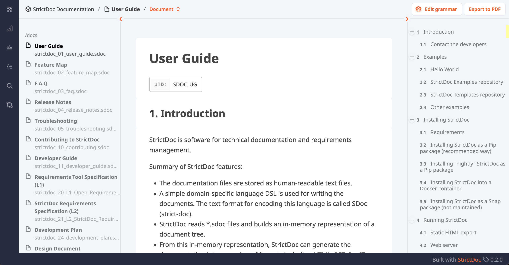
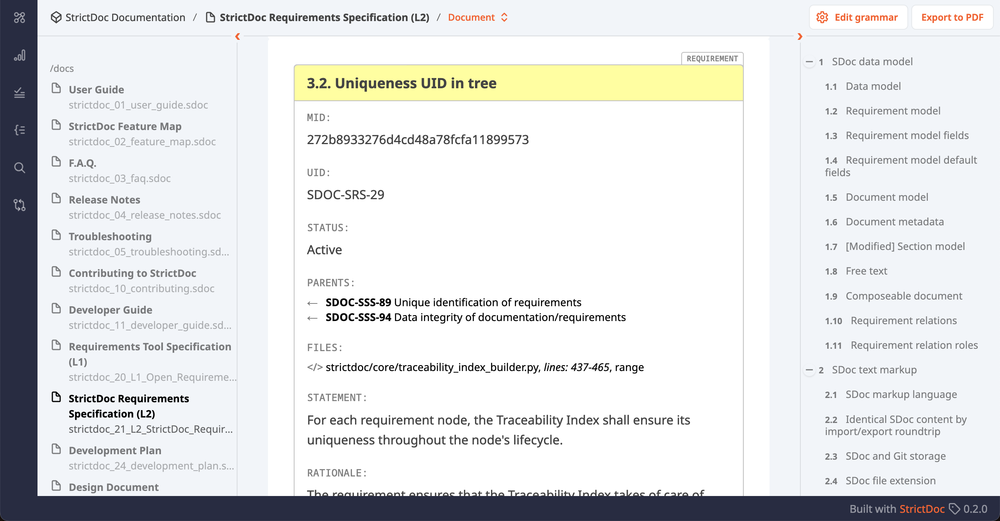
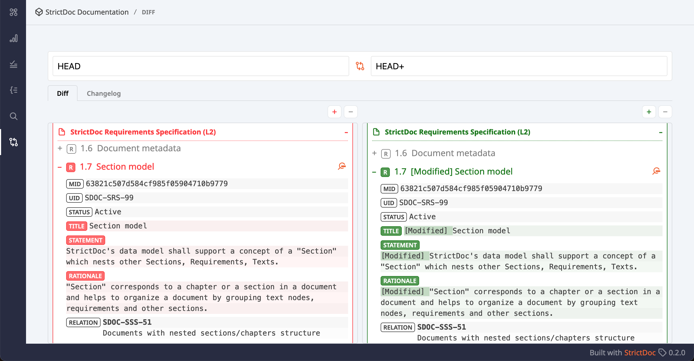

.. _SDOC_FEATURE_MAP:

StrictDoc Feature Map
$$$$$$$$$$$$$$$$$$$$$

This document provides a comprehensive overview of all available features in StrictDoc from the user's perspective. It includes descriptions and relevant screenshots to illustrate each feature's functionality. Each entry is linked to additional documentation, such as the :ref:`User Guide <SDOC_UG>`, offering further details, usage instructions, and examples to help users understand and effectively utilize StrictDoc’s capabilities.

.. _SECTION-FM-SDoc-text-markup:

SDoc text markup
================

Definition
----------

.. _SDOC-FEAT-1:

SDoc text markup
~~~~~~~~~~~~~~~~

.. list-table::
    :align: left
    :header-rows: 0

    * - **MID:**
      - 4c40803dd0f04af88fd722ba6b732270
    * - **UID:**
      - SDOC-FEAT-1
    * - **STATUS:**
      - Stable

The SDoc markup language is a hybrid format inspired by TOML, YAML, ASN.1, and HTML/XML, designed specifically for structuring technical documents with large volumes of requirements. It aims to encode documents that span up to several hundred or even a few thousand A4-printed pages, while keeping the markup noise minimal to maintain readability. The format supports both shallow and deeply nested document structures, accommodating up to 9-10 levels of chapter nesting, and allows for multiple meta-information fields around each requirement.

**DOCUMENTATION:**

- :ref:`SDoc syntax <SECTION-UG-SDoc-syntax>`

Use case
--------

The main use case for SDoc is to model a structure of a technical document that consists of tens and hundreds of technical requirements. The following high-level requirements for the markup are therefore relevant:

- Encode documents of reasonable size (up to several hundreds or few thousands of A4-printed pages).
- Visualize large blocks of requirements text without too much markup noise.
- Support documents with nested (2-4 levels) or deeply nested structure (detailed technical specifications with up to 9-10 levels of chapter nesting).
- Support multiple fields for requirement meta information which makes a requirement look like "a text with some meta information around it".

The SDoc markup has been pretty stable since its inception but the flexibility of the TextX parser allows easy modifications of the language in case of future evolutions. Any feedback to the current design of the markup language is appreciated.

Inspirations
------------

The SDoc markup is a hybrid of TOML and YAML with some influence from HTML/XML and `ASN.1 <https://en.wikipedia.org/wiki/ASN.1>`_. Using each of these formats as-is, and also the JSON format, was considered but discarded during the design.

**TOML: Square bracket syntax**

From TOML, StrictDoc borrowed the ``[]`` bracket syntax to create the ``[REQUIREMENT]``, ``[SECTION]`` and other blocks but uses the YAML-like syntax for these blocks' fields, for example:

.. code-block::

    [REQUIREMENT]
    TITLE: Requirement ABC
    STATEMENT: The system A shall do B when C.

**TOML/YAML: Arrays/dictionaries**

StrictDoc has a rudimentary support of arrays and dictionaries. For example, the syntax for defining the document's ``[GRAMMAR]`` resembles what would look like an array of records in YAML:

.. code-block::

    [GRAMMAR]
    ELEMENTS:
    - TAG: REQUIREMENT
      FIELDS:
      - TITLE: UID
        TYPE: String
        REQUIRED: True
      - TITLE: LEVEL
        TYPE: String
        REQUIRED: False

**Capitalization of reserved keywords from ASN.1**

From ASN.1, StrictDoc borrows the idea of having all reserved fields capitalized. This helps to visually distinguish between the grammar content and user content.

**Nested sections**

From HTML, the idea of opening and closing tags is taken to avoid any nesting that would otherwise be required to support the deeply nested documents with up to 6 or 8 levels, e.g., 1.1.1.1.1.1.1...

.. code-block::

    [SECTION]
    TITLE: Section 1

    [SECTION]
    TITLE: Section 1.1

    ...

    [/SECTION]

    [/SECTION]

Taking HTML or XML as-is didn't seem like a good option because of the heavy visual noise that is produced around the actual content by the surrounding tags.

**Multiline strings**

The support of multiline strings is arranged by a custom solution which helps to avoid any nesting of multiline text as well as to visually indicate the start and end parts of the multiline string in a visually unambiguous way. This is how the multiline string is declared:

.. code-block::

    [REQUIREMENT]
    TITLE: Requirement ABC
    STATEMENT: >>>
    The multiline requirement statement
    without any nesting.
    >>>

**Discarded options**

Taking TOML or YAML as-is didn't seem like a good option because these formats are designed to be used for configuration files or data serialization and not for large documents with hundreds of requirements. The most obvious problems for reusing either of TOML or YAML directly would have been with encoding the deeply nested documents and supporting readable and non-nested multiline strings.

Screenshots
-----------

.. image:: _assets/Feature_Screenshot_SDoc.png
   :alt: SDoc markup
   :class: image
   :width: 100%

HTML export
===========

Definition
----------

.. _SDOC-FEAT-2:

StrictDoc HTML export
~~~~~~~~~~~~~~~~~~~~~

.. list-table::
    :align: left
    :header-rows: 0

    * - **MID:**
      - 8e6604c8b27b450cbd21c12dc8572291
    * - **UID:**
      - SDOC-FEAT-2

StrictDoc's static HTML export feature allows users to generate comprehensive documentation from .sdoc files into a well-structured HTML format. It leverages an efficient in-memory representation of document trees, supporting large-scale documents with thousands of requirements while maintaining decent performance.

The HTML output preserves the hierarchy of requirements, including parent-child relationships, to facilitate traceability and coverage analysis.

Additionally, StrictDoc's incremental generation mechanism ensures quick updates by only regenerating modified documents, enabling efficient handling of extensive requirements specifications.

**DOCUMENTATION:**

- :ref:`Static HTML export <SECTION-UG-Static-HTML-export>`

Screenshots
-----------

.. image:: _assets/Feature_Screenshot_HTMLExport_01_Index.png
   :alt: StrictDoc HTML export – Project tree
   :class: image
   :width: 100%

Web-based graphical user interface
==================================

Definition
----------

.. _SDOC-FEAT-3:

StrictDoc web-based graphical user interface
~~~~~~~~~~~~~~~~~~~~~~~~~~~~~~~~~~~~~~~~~~~~

.. list-table::
    :align: left
    :header-rows: 0

    * - **MID:**
      - 2c1cde585d5944b5b7b5a0d5f72a98ed
    * - **UID:**
      - SDOC-FEAT-3
    * - **STATUS:**
      - Stable

StrictDoc features an editable web interface that enables users to view and modify requirements directly within their browser. This interface provides a user-friendly way to interact with .sdoc files, allowing real-time editing of documents and requirements. Changes made through the web interface are automatically saved back to the original text files, ensuring synchronization between the user interface and the underlying document structure. The web interface also supports visualization of requirement hierarchies and relationships, making it easier to manage complex documents with multiple nested levels and linked requirements.

**DOCUMENTATION:**

- :ref:`Web server <SECTION-UG-Web-server>`
- :ref:`Limitations of web user interface <SDOC_UG_LIMIT_WEB>`

Screenshots
-----------

.. image:: _assets/Feature_Screenshot_WebUI_2.png
   :alt: StrictDoc web interface
   :class: image
   :width: 100%

Traceability between requirements and source code
=================================================

Definition
----------

.. _SDOC-FEAT-4:

Traceability between requirements and source code
~~~~~~~~~~~~~~~~~~~~~~~~~~~~~~~~~~~~~~~~~~~~~~~~~

.. list-table::
    :align: left
    :header-rows: 0

    * - **MID:**
      - e14eee106ea443e598378e55401914dc
    * - **UID:**
      - SDOC-FEAT-4

StrictDoc supports traceability between requirements and source code, enabling the creation of links from requirements specified in .sdoc files to relevant source code files. This feature ensures that each requirement is adequately addressed in the implementation by associating it with corresponding segments of the codebase. Traceability links are defined using custom references, allowing teams to track which parts of the code fulfill specific requirements. This capability is essential for compliance, validation, and maintaining consistency between documentation and actual implementation. These connections can be visualized in the generated HTML exports, providing a clear and navigable overview of the relationship between requirements and the codebase​.

**DOCUMENTATION:**

- :ref:`Traceability between requirements and source code <SECTION-TRACEABILITY-REQS-TO-SOURCE-CODE>`

Screenshots
-----------

.. image:: _assets/Feature_Screenshot_TraceabilityToSource_2.png
   :alt: Traceability to source 2
   :class: image
   :width: 100%

Document grammar
================

Definition
----------

.. _SDOC-FEAT-5:

Custom document grammars
~~~~~~~~~~~~~~~~~~~~~~~~

.. list-table::
    :align: left
    :header-rows: 0

    * - **MID:**
      - 0bfcb6144dde487791d4f01164dd7e7c
    * - **UID:**
      - SDOC-FEAT-5

The "Document grammar" feature allows users to extend the default grammar to fit specific project needs, particularly useful for industries with specialized requirements documentation, such as automotive or aerospace. This feature supports defining custom fields like "PRIORITY," "VERIFICATION," or domain-specific tags like "ASIL" for automotive safety standards. Custom grammars are declared at the document level using the ``[GRAMMAR]`` directive, enabling users to specify custom fields and their data types, such as ``String``, ``SingleChoice``, ``MultipleChoice``. These fields can be marked as mandatory, ensuring consistency across requirements documents.

**DOCUMENTATION:**

- :ref:`Custom grammars <SECTION-CUSTOM-GRAMMARS>`

Screenshots
-----------

.. image:: _assets/Feature_Screenshot_Grammar.png
   :alt: Document grammar
   :class: image
   :width: 100%

Composable documents
====================

Definition
----------

.. _SDOC-FEAT-6:

Composable documents
~~~~~~~~~~~~~~~~~~~~

.. list-table::
    :align: left
    :header-rows: 0

    * - **MID:**
      - e7b2d61545eb414f97345ecac25c52cc
    * - **UID:**
      - SDOC-FEAT-6

The "Composable Documents" feature in StrictDoc enables users to create composite documents made up of smaller, independent SDoc documents. This modular approach allows each document fragment to be managed separately, which is particularly useful when dealing with large, complex requirements documents.

**DOCUMENTATION:**

- :ref:`Composing documents from other documents <UG_COMPOSABLE_DOCUMENTS>`

Export to RST
=============

Definition
----------

.. _SDOC-FEAT-8:

Export to RST
~~~~~~~~~~~~~

.. list-table::
    :align: left
    :header-rows: 0

    * - **MID:**
      - dd686a557c3e4e50ba89538a74d39383
    * - **UID:**
      - SDOC-FEAT-8
    * - **STATUS:**
      - Stable

The "Export to RST" feature in StrictDoc allows users to convert their SDoc documentation into reStructuredText (RST) format, which is compatible with Sphinx documentation generator. This process enables a two-stage conversion workflow where SDoc documents can first be exported to RST and then further processed by Sphinx to generate HTML websites, PDF documents, or other formats. This feature is particularly useful for users who already have a Sphinx-based documentation pipeline, as it integrates StrictDoc’s requirements management capabilities with Sphinx.

**DOCUMENTATION:**

- :ref:`HTML export via Sphinx <SECTION-UG-HTML-export-via-Sphinx>`
- :ref:`PDF export via Sphinx/LaTeX <SECTION-UG-PDF-export-via-Sphinx-LaTeX>`
- :ref:`Limitations of RST support by StrictDoc <SDOC_UG_LIMIT_RST>`

Screenshots
-----------

**Export to RST and PDF using Sphinx/LaTeX**

.. image:: _assets/Feature_Screenshot_RSTExport_01_SphinxPDF.png
    :alt: StrictDoc HTML export – Project tree
    :class: image
    :width: 100%

Export to PDF
=============

Definition
----------

.. _SDOC-FEAT-10:

Export to PDF
~~~~~~~~~~~~~

.. list-table::
    :align: left
    :header-rows: 0

    * - **MID:**
      - 5be4f35be2eb49faae7c33b5a2d83251
    * - **UID:**
      - SDOC-FEAT-10
    * - **STATUS:**
      - Experimental

The HTML2PDF feature in StrictDoc enables web-based printing to PDF by leveraging ChromeDriver and Google Chrome. This approach uses the Selenium Python library to automate the printing of HTML content directly to PDF format, ensuring that the final document mirrors the exact HTML content rendered in the browser.

The feature allows the user to export content to PDF via a web interface or through a command-line interface. This ensures that the output closely resembles the web page, with no need for additional formatting or adjustments to the content.

**DOCUMENTATION:**

- :ref:`HTML2PDF document generator <SECTION-UG-HTML2PDF-document-generator>`

Screenshots
-----------

Query engine and search screen
==============================

Definition
----------

.. _SDOC-FEAT-7:

Query engine and search screen
~~~~~~~~~~~~~~~~~~~~~~~~~~~~~~

.. list-table::
    :align: left
    :header-rows: 0

    * - **MID:**
      - 9c1e6cb601294891bcaae2b8c9042c59
    * - **UID:**
      - SDOC-FEAT-7
    * - **STATUS:**
      - Experimental

The "Query Engine and Search Screen" feature in StrictDoc offers tools for searching and filtering requirements within documents. It uses a Python-inspired syntax to perform complex queries on the document tree, allowing users to find specific sections or requirements based on attributes like titles, parent-child relationships, or custom fields. The search screen is integrated into the web interface, where users can craft queries with logical operators (e.g., AND, OR) and attribute filters (e.g., ``node.is_requirement``).

**DOCUMENTATION:**

- :ref:`Search and filtering <SECTION-UG-Search-and-filtering>`

Screenshots
-----------

.. image:: _assets/Feature_Screenshot_SearchScreen_01.png
   :alt: StrictDoc Search Screen
   :class: image
   :width: 100%

Project statistics
==================

Definition
----------

.. _SDOC-FEAT-11:

Project Statistics
~~~~~~~~~~~~~~~~~~

.. list-table::
    :align: left
    :header-rows: 0

    * - **MID:**
      - 2dd0b514a24f43a287a4096d0be0af58
    * - **UID:**
      - SDOC-FEAT-11
    * - **STATUS:**
      - Experimental

The "Project Statistics" feature in StrictDoc provides insights into the overall status and details of a documentation project. It offers statistical data that can include information about requirements, document structure, and coverage.

**DOCUMENTATION:**

- :ref:`Project statistics screen <SECTION-UG-Project-statistics-screen>`

Screenshots
-----------

.. image:: _assets/Feature_Screenshot_StatisticsScreen_01.png
   :alt: Project statistics
   :class: image
   :width: 100%

.. image:: _assets/Feature_Screenshot_StatisticsScreen_02.png
   :alt: Project statistics
   :class: image
   :width: 100%

Documentation diff/changelog
============================

Definition
----------

.. _SDOC-FEAT-12:

Documentation diff/changelog
~~~~~~~~~~~~~~~~~~~~~~~~~~~~

.. list-table::
    :align: left
    :header-rows: 0

    * - **MID:**
      - e9da42f8e39b438a8e8eada16b280706
    * - **UID:**
      - SDOC-FEAT-12
    * - **STATUS:**
      - Experimental

The "Documentation diff/changelog" feature in StrictDoc allows users to track and compare changes made between different versions of project documentation. This feature can highlight modifications at a granular level, such as added, deleted, or altered content within the document.

**DOCUMENTATION:**

- :ref:`Diff/changelog screen <SECTION-UG-Diff-changelog-screen>`

Screenshots
-----------

.. image:: _assets/Feature_Screenshot_DiffChangelog_2.png
   :alt: StrictDoc Diff/Changelog 2
   :class: image
   :width: 100%

ReqIF support
=============

Definition
----------

.. _SDOC-FEAT-13:

ReqIF support
~~~~~~~~~~~~~

.. list-table::
    :align: left
    :header-rows: 0

    * - **MID:**
      - 2845463f977d4b51ac788c2fc9cbd894
    * - **UID:**
      - SDOC-FEAT-13
    * - **STATUS:**
      - Experimental

The ReqIF support feature in StrictDoc allows for both importing and exporting to the ReqIF format, facilitating interoperability with other requirements management tools.

ReqIF is a widely used XML-based standard for requirements data exchange. The import flow allows ReqIF files to be converted into SDoc documents, while the export flow enables SDoc content to be converted back into ReqIF format.

The implementation of ReqIF support is tool-specific due to the flexibility of the ReqIF standard. Different tools may structure and name their fields differently, which means the export/import workflows may require adjustments depending on the tools involved. StrictDoc provides its own model for converting between ReqIF and SDoc, making it adaptable for specific use cases while striving for compatibility with the ReqIF format recommended by the ReqIF Implementation Guide​.

**DOCUMENTATION:**

- :ref:`ReqIF support <SECTION-UG-ReqIF-support>`

Project configuration
=====================

Definition
----------

.. _SDOC-FEAT-9:

Project configuration
~~~~~~~~~~~~~~~~~~~~~

.. list-table::
    :align: left
    :header-rows: 0

    * - **MID:**
      - 8fc72d79bfe940aba2cf041e263b92df
    * - **UID:**
      - SDOC-FEAT-9

The "strictdoc.toml" file is a project-level configuration file used in StrictDoc to manage various project settings. This configuration file allows customization for features such as selected functionalities, document paths, source file paths, etc.

Key options in the "strictdoc.toml" file include:

- Project title: Defines a project title.
- Feature selection: Selects additional features to activate or deactivate, such as traceability features or experimental tools.
- Paths customization: cache dir, asset dir, document include/exclude paths, source file include/exclude paths, etc.

This configuration ensures that StrictDoc works according to the specific needs of a given project, making it more flexible and adaptable​.

**DOCUMENTATION:**

- :ref:`Project-level options <SDOC_UG_OPTIONS_PROJECT_LEVEL>`

Screenshots
-----------

.. image:: _assets/Feature_Screenshot_StrictDocTOML.png
   :alt: StrictDoc config file strictdoc.toml
   :class: image
   :width: 100%
