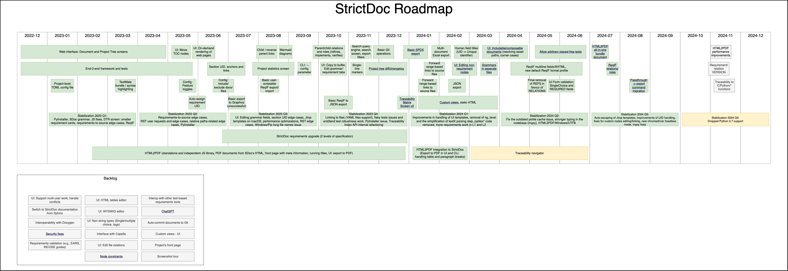

Development Plan
$$$$$$$$$$$$$$$$

This document presents the goals of the StrictDoc project and describes how the
project is developed.

Project goals
=============

StrictDoc is an open-source tool for writing technical documentation and requirements management. The long-term goal of the project is to provide a capable, open-source platform for creating and managing technical documentation.

**Requirements automation**

The tool aims to automate the requirements documentation process at various levels.

**Target groups**

The project targets different user groups including those in software, hardware, systems (systems engineering, electrical, thermal), as well as quality assurance, safety, management, and non-technical areas.

**Use on individual computers and cloud**

The project is already usable on individual personal computer, the long-term goal is to enable its use on cloud.

**Open data**

An important feature of StrictDoc is its focus on open data, ensuring ease of data transfer both into and out of the system.

**Synergies with other tools**

StrictDoc shall be compatible with other software and engineering tools. This includes at least the compatibility with the Python ecosystem, the model-based systems engineering tools, such as Capella, and the formats providing Software Bill of Materials, such as SPDX.

Project milestones
==================

As an open-source project, StrictDoc is developed without strict deadlines, however there are certain high-level priorities that influence the development. The work is loosely organized in quarters.

.. list-table::
   :header-rows: 1
   :widths: 15 85

   * - **Quarter**
     - **Planned / accomplished work**

   * - 2019-Q2
     - Pre-StrictDoc development in a fork of Doorstop.
   * - 2019-Q3
     - StrictDoc, first prototype. Markdown-based C++ program. Custom requirements metadata in YAML.
   * - 2020-Q1
     - The second prototype of StrictDoc based on RST/Sphinx. Using Sphinx extensions to manage meta information. First integration tests.
   * - 2020-Q2
     - StrictDoc created on GitHub. The code still uses RST for parsing requirements meta information and PySide for GUI.
   * - 2020-Q3
     - The RST parsing is replaced with a TextX-based DSL, new StrictDoc grammar is created. The PySide is replaced with a simple export to HTML using Jinja templates. Export to Sphinx HTML/PDF is introduced.
   * - 2020-Q4
     - Improvements in the styles of HTML/PDF exports. First Table, Traceability, and Deep Traceability screens.
   * - 2021-Q1
     - Excel export. The first implementation for forward and reverse traceability between SDoc and source files.
   * - 2021-Q2
     - Further work on the SDoc-source traceability.
   * - 2021-Q3
     - Further work on the SDoc-source traceability. Tree cycles detection, validations. MathJax support.
   * - 2021-Q4
     - Improvements of the traceability index generation and validation. Initial implementation of ReqIF. First support of custom grammars.
   * - 2022-Q1
     - Further work on ReqIF and custom grammars. Document fragments feature.
   * - 2022-Q2
     - Excel conversion improvements. Improvements of how meta information is displayed in HTML export.
   * - 2022-Q3
     - No work in this quarter.
   * - 2022-Q4
     - Installation using PyInstaller. The first prototype of a Web-based interface. First end-to-end Web tests using SeleniumBase. Improvements of the ReqIF support.
   * - 2023-Q1
     - Improvements of the Web-based interface towards first release. Improvements of the ReqIF support.
   * - 2023-Q2
     - Further stabilization of the Web interface. RST markup stability improvements. Work on StrictDoc's own requirements traceability.
   * - 2023-Q3
     - Anchors and incoming links. Improvements of the ReqIF interface. Work on StrictDoc's own requirements traceability. Mermaid diagramming tool. Reverse parent / child links. Project statistics screen. Performance improvements.
   * - 2023-Q4
     - Requirements relations and roles. UI improvements and stabilization. Further ReqIF work. Search engine and requirements filters. Project tree Diff/Changelog screens. Basic Git operations.
   * - 2024-Q1
     - TBD

The roadmap diagram
-------------------

The following diagram contains the work items at the epic and single task levels. This PNG file is exported from a draw.io diagram, where the master version of the roadmap is maintained.

Verification
============

StrictDoc has three groups of tests: unit, integration, end-to-end tests.

The unit tests are based on Pylint.

The integration tests are based on the `LLVM Integrated Tester <https://llvm.org/docs/CommandGuide/lit.html>`_ and `FileCheck.py <https://github.com/mull-project/FileCheck.py/blob/main/pyproject.toml>`_. These tools are not very common, refer to `How to test command-line programs with Python tools: LIT and FileCheck <https://stanislaw.github.io/2020-11-20-how-to-test-command-line-programs-with-python.html>`_ for a good description.

The end-to-end web interface tests are based on SeleniumBase test framework.

Python baseline
===============

The supported version of Python is kept to be as low as possible. As of 2023-Q4, the currently supported version is Python 3.7.

Ideally, the lowest Python version should only be raised when it is consistently deprecated by the major software platforms like Ubuntu or GitHub Actions.

Another reason for upgrading the minimum Python version is due to the upstream dependencies. As these dependencies stop supporting the older versions of Python, StrictDoc must be upgraded to maintain compatibility. With the existing dependency graph, this happens rather infrequently as most dependencies also maintain the compatibility with the older Python versions.
